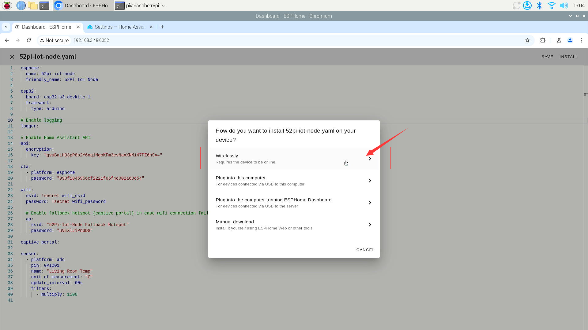

# Upload firmware via OTA mode 

## Benefits of Using ESPHome's OTA Mode for Firmware Updates

Using ESPHome's Over-The-Air (OTA) mode for updating firmware offers several advantages:

- **Convenience**: OTA updates allow you to remotely update your devices over Wi-Fi without the need for physical access, which is especially useful for devices in hard-to-reach locations.
- **Efficiency**: Updates can be rolled out quickly and efficiently to multiple devices at once, reducing the time and effort required for manual updates.
- **Security**: ESPHome's OTA updates are secure, ensuring that the firmware updates are delivered safely and maintaining the integrity of the devices.
- **Flexibility**: With OTA updates, you can easily push out bug fixes and new features to your devices without having to recall or redeploy them.
- **Simplicity**: The setup process for OTA updates in ESPHome is relatively straightforward, making it accessible even for beginners in the IoT space.
- **Integration**: ESPHome's OTA platform integrates seamlessly with popular platforms like Home Assistant, allowing for easy management of home automation devices.
- **Safe Mode**: In case updates don't work as expected, ESPHome supports a "safe mode" for recovery, which is automatically enabled by the OTA component.
- **Automation**: ESPHome provides various automations that can be used to give feedback during the OTA update process, such as starting, reporting progress, ending, or error handling.
- **Password Protection**: You can set a password for updates to ensure that only authorized updates are installed, adding an extra layer of security.
- **Multiple Update Mechanisms**: ESPHome allows the use of multiple update mechanisms, enabling greater flexibility.
- **Feedback During Updates**: OTA updates block the main application loop while in progress, ensuring that updates are applied correctly without interference from other processes.
- **Easy Recovery**: If an OTA update fails, the device can be easily recovered using the safe mode or by simply performing a power-cycle.

By leveraging these benefits, ESPHome's OTA mode streamlines the firmware update process, making it more manageable and reliable for IoT devices.

## How to use OTA update by using ESPHome? 

* First, make sure that you have downloaded the firmware for the ESP32 device using manual mode during the initial setup, and ensure that it is online on the ESPHOME page.

* Edit the YAML configuration file and compile the OTA firmware.

* Compile and upload new firmware to ESP32 board via ESPHome's `wirelessly`. 

## For example
* Reading temperature information from GPIO1 which connected a NTC sensor. 

### Modify `*.yaml` file 
Click `Edit` button on screen. 


Modify `52pi-iot-node.yaml` file and adding following lines.
 

```YAML
sensor:
  - platform: adc
    pin: GPIO1
    name: "Living Room Temp"
    unit_of_measurement: "°C"
    update_interval: 60s
    filters:
      - multiply: 1500
```


* Save it and click `install` and then select `wirelessly` on screen.



* Waiting for compiling.


* It will connect reset after upload the new firmware, and will print a lot of
logs you can refer to.  


* You will see the result at the `cyan` color line.


This means that you have successfully completed the OTA upgrade and collected temperature information through the device connected to GPIO1. Next, let's combine the use of the modules in the 52pi plant watering kit to explain how to write the YAML file respectively; you can move on to the next chapter.

