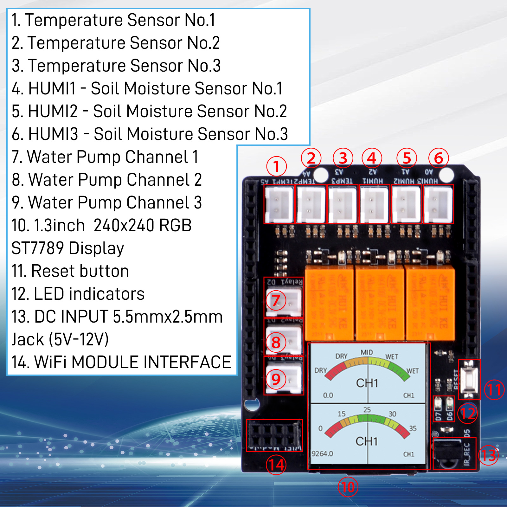

# Blink LEDs

## How to blink LEDs on 52Pi Plant watering kit with 52Pi ESPHome IoT-node?

First of all, please checkout the outlook of 52pi plant watering kit's Hat
board.

 

### Pinout
 
After you snap the 52pi plant water kit's HAT board onto the 52pi ESPHome IoT Node baseboard, you need to pay attention to which pins on the baseboard the sensors and relays, LED lights, screens, and other devices on the HAT board are connected to. Therefore, you need to carefully observe the corresponding table and graphical description of the devices and pins below. This is very important for you when modifying the YAML configuration file later, as incorrect pin information will prevent the HAT board from being used correctly.
 

#### 1.3 Inch IPS 240x240 Display 
The display on the hat communicates with IOT Node baseboard via `SPI` protocol.
and chipset is `ST7789V`. 

|Function | Pin Number | 
|:---:|:---:|
|CLK_PIN | GPIO12 |
|MOSI_PIN | GPIO46 |
|CS_PIN| GPIO42 |
|DC_PIN | GPIO48 |
|RESET | GPIO0 |

#### PCF8574 I/O Expansion 
The PCF8574 chip is used here for I/O expansion, it communicates with the ESP32 using the I2C protocol, and it expands to provide 8 separate pins.

* I2C Pinout 

|Function | Pin Number | 
|:---:|:---:|
|SDA| GPIO9 |
|SCL| GPIO10 |

* Expansion Pin 

|IO number | sensor on hat | NOTE |
|:---:|:---:|:---:|
| IO0 | N/A | needs to set: inverted:true on *.yaml file |  
| IO1 | N/A | needs to set: inverted:true on *.yaml file |  
| IO2 | N/A | needs to set: inverted:true on *.yaml file |  
| IO3 | Camera Enable Pin| HIGH level: Disable, LOW level: Enable|  
| IO4 |  | |  
| IO5 | | |  
| IO6 | | |  
| IO7 | | |  
| IO8 | | |  
| IO9 | | |  
| IO10 |||  
| IO11 |||  
| IO12 |||  
| IO13 |||  
| IO14 |||  
| IO15 |||  

