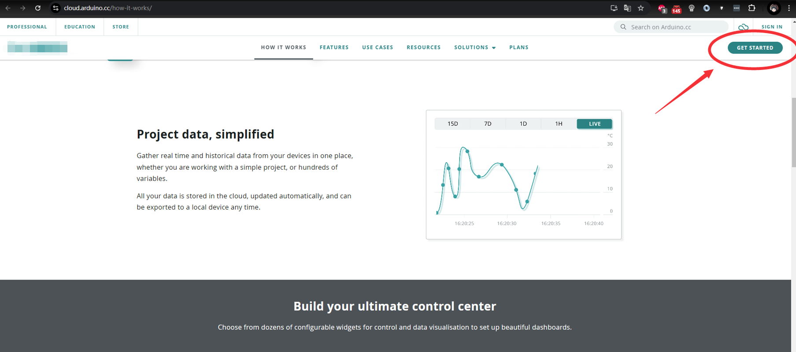
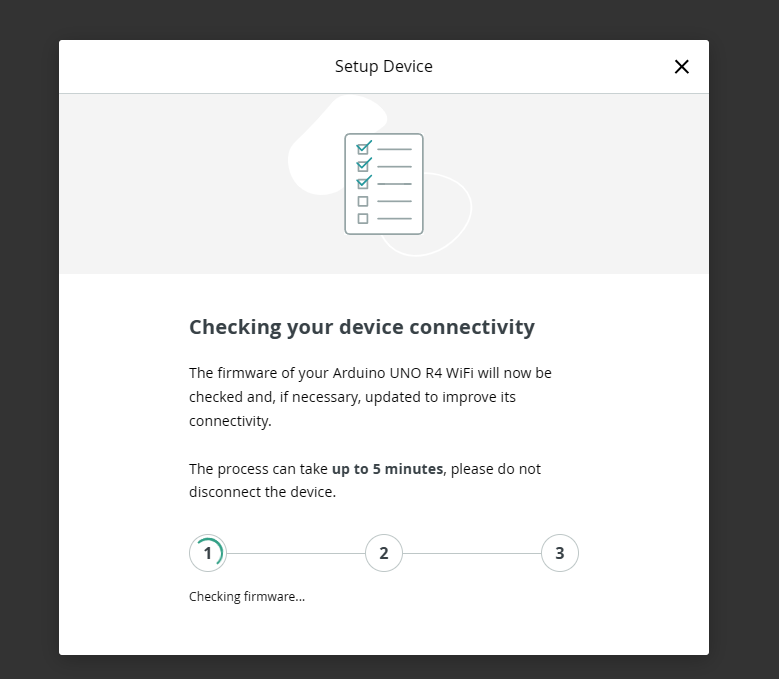
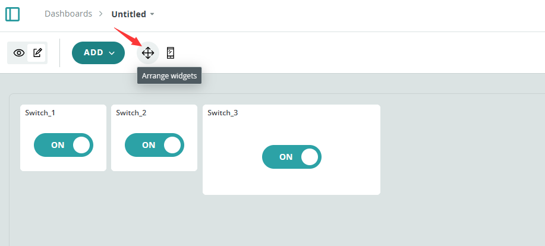
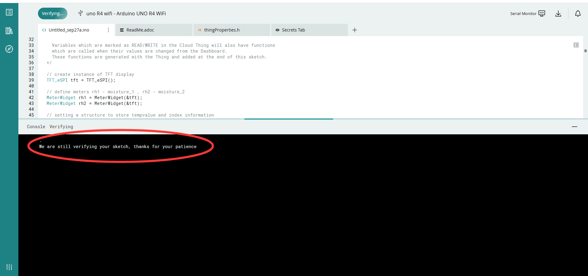

# Play with Arduino Cloud 

## About Arduino Cloud

Arduino Cloud is an online platform designed to simplify the process of creating, deploying, and monitoring IoT projects. 
It provides a comprehensive set of tools and features that cater to individuals, schools, and businesses, making it easy to connect devices, visualize data, and control projects from anywhere in the world.

#### Key Features

- **Easy Setup**: Arduino Cloud automates the initial configuration of your devices, allowing you to get started quickly without extensive coding knowledge.
- **Over-the-Air Updates**: You can update your device firmware wirelessly, which is particularly useful for projects that are not easily accessible.
- **Device-to-Device Communication**: It enables communication between different devices, expanding the potential of your IoT projects.
- **Customizable Dashboards**: Create and customize dashboards to control and monitor your devices with ease.
- **API Integration**: Advanced users can integrate Arduino Cloud with other systems and platforms using the provided APIs.
- **Webhooks**: Connect your projects with external services like IFTTT and Zapier for extended functionality.
- **Firmware Updates**: The platform automatically checks for firmware updates, ensuring your devices are always up-to-date.
- **Sharing Capabilities**: Share your dashboards with others, allowing collaboration or demonstration of your projects.
- **Security**: Arduino Cloud services are ISO 27001 certified, ensuring a secure environment for your IoT projects.

#### Benefits

- **Simplicity**: Arduino Cloud abstracts much of the complexity involved in IoT projects, making it accessible to beginners and experts alike.
- **Scalability**: Whether you're working on a small home project or a large-scale industrial application, Arduino Cloud can scale to meet your needs.
- **Flexibility**: With support for a wide range of devices and programming languages, Arduino Cloud is versatile enough to fit various project requirements.
- **Community**: As part of the Arduino ecosystem, you can leverage the knowledge and support of a large community of makers and developers.

#### What Arduino Cloud Can Bring to You

- **Efficiency**: Save time on project setup and maintenance with automated features and remote management capabilities.
- **Innovation**: Quickly prototype and iterate on your IoT ideas using Arduino Cloud's intuitive tools.
- **Collaboration**: Work with others on projects by sharing dashboards and sketches.
- **Learning**: Arduino Cloud is an excellent platform for learning about IoT and connected devices, with a wealth of resources and a supportive community.

In summary, Arduino Cloud offers a powerful yet user-friendly platform for IoT project development, suitable for a wide range of users from hobbyists to enterprise developers.


## Getting start 

Here is an example for using arduino cloud step by step. 

* Official URL Please refer to: [official arduino cloud](https://cloud.arduino.cc/how-it-works/)

### Step 1. Sign IN 

* Sign IN arduino cloud
Open a browser and access this link:
[https://cloud.arduino.cc/how-it-works/](https://cloud.arduino.cc/how-it-works/) 
Click `Get Started`.



If you don't have account yet, create your accout.


If you have account already, just input your Email address and password to
    login.


Next step is to `create sketch`. 


> NOTE: You may need to download and install the cloud agent before next step. 


* Click `select device`


If you want to add more file, click `+` on tab, create a new header file named it
    `PinDefinitionsAndMore` 
Copy and paste following code: 
```cpp
/*
 *  PinDefinitionsAndMore.h
 *
 *  Contains pin definitions for IRremote examples for various platforms
 *  as well as definitions for feedback LED and tone() and includes
 *
 *  Copyright (C) 2021-2023  Armin Joachimsmeyer
 *  armin.joachimsmeyer@gmail.com
 *
 *  This file is part of IRremote https://github.com/Arduino-IRremote/Arduino-IRremote.
 *
 *  Arduino-IRremote is free software: you can redistribute it and/or modify
 *  it under the terms of the GNU General Public License as published by
 *  the Free Software Foundation, either version 3 of the License, or
 *  (at your option) any later version.
 *
 *  This program is distributed in the hope that it will be useful,
 *  but WITHOUT ANY WARRANTY; without even the implied warranty of
 *  MERCHANTABILITY or FITNESS FOR A PARTICULAR PURPOSE.
 *  See the GNU General Public License for more details.
 *
 *  You should have received a copy of the GNU General Public License
 *  along with this program. If not, see <http://www.gnu.org/licenses/gpl.html>.
 *
 */

/*
 * Pin mapping table for different platforms
 *
 * Platform     IR input    IR output   Tone      Core/Pin schema
 * --------------------------------------------------------------
 * DEFAULT/AVR  2           3           4         Arduino
 * ATtinyX5     0|PB0       4|PB4       3|PB3     ATTinyCore
 * ATtiny167    3|PA3       2|PA2       7|PA7     ATTinyCore
 * ATtiny167    9|PA3       8|PA2       5|PA7     Digispark original core
 * ATtiny84      |PB2        |PA4        |PA3     ATTinyCore
 * ATtiny88     3|PD3       4|PD4       9|PB1     ATTinyCore
 * ATtiny3217  18|PA1      19|PA2      20|PA3     MegaTinyCore
 * ATtiny1604   2           3|PA5       %
 * ATtiny816   14|PA1      16|PA3       1|PA5     MegaTinyCore
 * ATtiny1614   8|PA1      10|PA3       1|PA5     MegaTinyCore
 * SAMD21       3           4           5
 * ESP8266      14|D5       12|D6       %
 * ESP32        15          4          27
 * ESP32-C3     6           7          10
 * BluePill     PA6         PA7       PA3
 * APOLLO3      11          12          5
 * RP2040       3|GPIO15    4|GPIO16    5|GPIO17
 */
//#define _IR_MEASURE_TIMING // For debugging purposes.

#if defined(__AVR__)
#if defined(__AVR_ATtiny25__) || defined(__AVR_ATtiny45__) || defined(__AVR_ATtiny85__) // Digispark board. For use with ATTinyCore.
#include "ATtinySerialOut.hpp" // TX is at pin 2 - Available as Arduino library "ATtinySerialOut". Saves 700 bytes program memory and 70 bytes RAM for ATtinyCore.
#define IR_RECEIVE_PIN  PIN_PB0
#define IR_SEND_PIN     PIN_PB4 // Pin 2 is serial output with ATtinySerialOut. Pin 1 is internal LED and Pin3 is USB+ with pullup on Digispark board.
#define TONE_PIN        PIN_PB3
#define _IR_TIMING_TEST_PIN PIN_PB3

#  elif defined(__AVR_ATtiny87__) || defined(__AVR_ATtiny167__) // Digispark pro board
#include "ATtinySerialOut.hpp" // Available as Arduino library "ATtinySerialOut"
// For ATtiny167 Pins PB6 and PA3 are usable as interrupt source.
#  if defined(ARDUINO_AVR_DIGISPARKPRO)
// For use with Digispark original core
#define IR_RECEIVE_PIN   9 // PA3 - on Digispark board labeled as pin 9
//#define IR_RECEIVE_PIN  14 // PB6 / INT0 is connected to USB+ on DigisparkPro boards
#define IR_SEND_PIN      8 // PA2 - on Digispark board labeled as pin 8
#define TONE_PIN         5 // PA7 - on Digispark board labeled as pin 5
#define _IR_TIMING_TEST_PIN 10 // PA4
#  else
// For use with ATTinyCore
#define IR_RECEIVE_PIN  PIN_PA3 // On Digispark board labeled as pin 9 - INT0 is connected to USB+ on DigisparkPro boards
#define IR_SEND_PIN     PIN_PA2 // On Digispark board labeled as pin 8
#define TONE_PIN        PIN_PA7 // On Digispark board labeled as pin 5
#  endif

#  elif defined(__AVR_ATtiny84__) // For use with ATTinyCore
#include "ATtinySerialOut.hpp" // Available as Arduino library "ATtinySerialOut". Saves 128 bytes program memory.
#define IR_RECEIVE_PIN   PIN_PB2 // INT0
#define IR_SEND_PIN      PIN_PA4
#define TONE_PIN         PIN_PA3
#define _IR_TIMING_TEST_PIN PIN_PA5

#  elif defined(__AVR_ATtiny88__) // MH-ET Tiny88 board. For use with ATTinyCore.
#include "ATtinySerialOut.hpp" // Available as Arduino library "ATtinySerialOut". Saves 128 bytes program memory.
// Pin 6 is TX, pin 7 is RX
#define IR_RECEIVE_PIN   PIN_PD3 // 3 - INT1
#define IR_SEND_PIN      PIN_PD4 // 4
#define TONE_PIN         PIN_PB1 // 9
#define _IR_TIMING_TEST_PIN PIN_PB0 // 8

#  elif defined(__AVR_ATtiny1616__)  || defined(__AVR_ATtiny3216__) || defined(__AVR_ATtiny3217__) // For use with megaTinyCore
// Tiny Core Dev board
// https://www.tindie.com/products/xkimi/tiny-core-16-dev-board-attiny1616/ - Out of Stock
// https://www.tindie.com/products/xkimi/tiny-core-32-dev-board-attiny3217/ - Out of Stock
#define IR_RECEIVE_PIN   PIN_PA1 // use 18 instead of PIN_PA1 for TinyCore32
#define IR_SEND_PIN      PIN_PA2 // 19
#define TONE_PIN         PIN_PA3 // 20
#define APPLICATION_PIN  PIN_PA0 // 0
#undef LED_BUILTIN               // No LED available on the TinyCore 32 board, take the one on the programming board which is connected to the DAC output
#define LED_BUILTIN      PIN_PA6 // use 2 instead of PIN_PA6 for TinyCore32

#  elif defined(__AVR_ATtiny816__) // For use with megaTinyCore
#define IR_RECEIVE_PIN  PIN_PA1 // 14
#define IR_SEND_PIN     PIN_PA1 // 16
#define TONE_PIN        PIN_PA5 // 1
#define APPLICATION_PIN PIN_PA4 // 0
#undef LED_BUILTIN              // No LED available, take the one which is connected to the DAC output
#define LED_BUILTIN     PIN_PB5 // 4

#  elif defined(__AVR_ATtiny1614__) // For use with megaTinyCore
#define IR_RECEIVE_PIN   PIN_PA1 // 8
#define IR_SEND_PIN      PIN_PA3 // 10
#define TONE_PIN         PIN_PA5 // 1
#define APPLICATION_PIN  PIN_PA4 // 0

#  elif defined(__AVR_ATtiny1604__) // For use with megaTinyCore
#define IR_RECEIVE_PIN   PIN_PA6 // 2 - To be compatible with interrupt example, pin 2 is chosen here.
#define IR_SEND_PIN      PIN_PA7 // 3
#define APPLICATION_PIN  PIN_PB2 // 5

#define tone(...) void()      // Define as void, since TCB0_INT_vect is also used by tone()
#define noTone(a) void()
#define TONE_PIN         42 // Dummy for examples using it

#  elif defined(__AVR_ATmega1284__) || defined(__AVR_ATmega1284P__) \
|| defined(__AVR_ATmega644__) || defined(__AVR_ATmega644P__) \
|| defined(__AVR_ATmega324P__) || defined(__AVR_ATmega324A__) \
|| defined(__AVR_ATmega324PA__) || defined(__AVR_ATmega164A__) \
|| defined(__AVR_ATmega164P__) || defined(__AVR_ATmega32__) \
|| defined(__AVR_ATmega16__) || defined(__AVR_ATmega8535__) \
|| defined(__AVR_ATmega64__) || defined(__AVR_ATmega128__) \
|| defined(__AVR_ATmega1281__) || defined(__AVR_ATmega2561__) \
|| defined(__AVR_ATmega8515__) || defined(__AVR_ATmega162__)
#define IR_RECEIVE_PIN      2
#define IR_SEND_PIN        13
#define TONE_PIN            4
#define APPLICATION_PIN     5
#define ALTERNATIVE_IR_FEEDBACK_LED_PIN 6 // E.g. used for examples which use LED_BUILDIN for example output.
#define _IR_TIMING_TEST_PIN 7

#  else // Default as for ATmega328 like on Uno, Nano, Leonardo, Teensy 2.0 etc.
#define IR_RECEIVE_PIN      2 // To be compatible with interrupt example, pin 2 is chosen here.
#define IR_SEND_PIN         3
#define TONE_PIN            4
#define APPLICATION_PIN     5
#define ALTERNATIVE_IR_FEEDBACK_LED_PIN 6 // E.g. used for examples which use LED_BUILDIN for example output.
#define _IR_TIMING_TEST_PIN 7

#    if defined(ARDUINO_AVR_PROMICRO) // Sparkfun Pro Micro is __AVR_ATmega32U4__ but has different external circuit
// We have no built in LED at pin 13 -> reuse RX LED
#undef LED_BUILTIN
#define LED_BUILTIN         LED_BUILTIN_RX
#    endif
#  endif // defined(__AVR_ATtiny25__)...

#elif defined(ARDUINO_ARCH_RENESAS_UNO) // Uno R4
// To be compatible with Uno R3.
#define IR_RECEIVE_PIN      2
#define IR_SEND_PIN         3
#define TONE_PIN            4
#define APPLICATION_PIN     5
#define ALTERNATIVE_IR_FEEDBACK_LED_PIN 6 // E.g. used for examples which use LED_BUILDIN for example output.
#define _IR_TIMING_TEST_PIN 7

#elif defined(ESP8266)
#define FEEDBACK_LED_IS_ACTIVE_LOW // The LED on my board (D4) is active LOW
#define IR_RECEIVE_PIN          14 // D5
#define IR_SEND_PIN             12 // D6 - D4/pin 2 is internal LED
#define _IR_TIMING_TEST_PIN      2 // D4
#define APPLICATION_PIN         13 // D7

#define tone(...) void()      // tone() inhibits receive timer
#define noTone(a) void()
#define TONE_PIN                42 // Dummy for examples using it

#elif defined(CONFIG_IDF_TARGET_ESP32C3) || defined(ARDUINO_ESP32C3_DEV)
#define NO_LED_FEEDBACK_CODE   // The  WS2812 on pin 8 of AI-C3 board crashes if used as receive feedback LED, other I/O pins are working...
#define IR_RECEIVE_PIN           6
#define IR_SEND_PIN              7
#define TONE_PIN                10
#define APPLICATION_PIN         18

#elif defined(ESP32)
#include <Arduino.h>

// tone() is included in ESP32 core since 2.0.2
#if !defined(ESP_ARDUINO_VERSION_VAL)
#define ESP_ARDUINO_VERSION_VAL(major, minor, patch) 12345678
#endif
#if ESP_ARDUINO_VERSION  <= ESP_ARDUINO_VERSION_VAL(2, 0, 2)
#define TONE_LEDC_CHANNEL        1  // Using channel 1 makes tone() independent of receiving timer -> No need to stop receiving timer.
void tone(uint8_t aPinNumber, unsigned int aFrequency){
    ledcAttachPin(aPinNumber, TONE_LEDC_CHANNEL);
    ledcWriteTone(TONE_LEDC_CHANNEL, aFrequency);
}
void tone(uint8_t aPinNumber, unsigned int aFrequency, unsigned long aDuration){
    ledcAttachPin(aPinNumber, TONE_LEDC_CHANNEL);
    ledcWriteTone(TONE_LEDC_CHANNEL, aFrequency);
    delay(aDuration);
    ledcWriteTone(TONE_LEDC_CHANNEL, 0);
}
void noTone(uint8_t aPinNumber){
    ledcWriteTone(TONE_LEDC_CHANNEL, 0);
}
#endif // ESP_ARDUINO_VERSION  <= ESP_ARDUINO_VERSION_VAL(2, 0, 2)

#define IR_RECEIVE_PIN          15  // D15
#define IR_SEND_PIN              4  // D4
#define TONE_PIN                27  // D27 25 & 26 are DAC0 and 1
#define APPLICATION_PIN         16  // RX2 pin

#elif defined(ARDUINO_ARCH_STM32) || defined(ARDUINO_ARCH_STM32F1) // BluePill
// Timer 3 blocks PA6, PA7, PB0, PB1 for use by Servo or tone()
#define IR_RECEIVE_PIN          PA6
#define IR_RECEIVE_PIN_STRING   "PA6"
#define IR_SEND_PIN             PA7
#define IR_SEND_PIN_STRING      "PA7"
#define TONE_PIN                PA3
#define _IR_TIMING_TEST_PIN     PA5
#define APPLICATION_PIN         PA2
#define APPLICATION_PIN_STRING  "PA2"
#  if defined(ARDUINO_GENERIC_STM32F103C) || defined(ARDUINO_BLUEPILL_F103C8)
// BluePill LED is active low
#define FEEDBACK_LED_IS_ACTIVE_LOW
#  endif

#elif defined(ARDUINO_ARCH_APOLLO3) // Sparkfun Apollo boards
#define IR_RECEIVE_PIN  11
#define IR_SEND_PIN     12
#define TONE_PIN         5

#elif defined(ARDUINO_ARCH_MBED) && defined(ARDUINO_ARCH_MBED_NANO) // Arduino Nano 33 BLE
#define IR_RECEIVE_PIN      3   // GPIO15 Start with pin 3 since pin 2|GPIO25 is connected to LED on Pi pico
#define IR_SEND_PIN         4   // GPIO16
#define TONE_PIN            5
#define APPLICATION_PIN     6
#define ALTERNATIVE_IR_FEEDBACK_LED_PIN 7 // E.g. used for examples which use LED_BUILDIN for example output.
#define _IR_TIMING_TEST_PIN 8

#elif defined(ARDUINO_ARCH_RP2040) // Arduino Nano Connect, Pi Pico with arduino-pico core https://github.com/earlephilhower/arduino-pico
#define IR_RECEIVE_PIN      15  // GPIO15 to be compatible with the Arduino Nano RP2040 Connect (pin3)
#define IR_SEND_PIN         16  // GPIO16
#define TONE_PIN            17
#define APPLICATION_PIN     18
#define ALTERNATIVE_IR_FEEDBACK_LED_PIN 19 // E.g. used for examples which use LED_BUILDIN for example output.
#define _IR_TIMING_TEST_PIN 20

// If you program the Nano RP2040 Connect with this core, then you must redefine LED_BUILTIN
// and use the external reset with 1 kOhm to ground to enter UF2 mode
#undef LED_BUILTIN
#define LED_BUILTIN          6

#elif defined(PARTICLE) // !!!UNTESTED!!!
#define IR_RECEIVE_PIN      A4
#define IR_SEND_PIN         A5 // Particle supports multiple pins

#define LED_BUILTIN         D7

/*
 * 4 times the same (default) layout for easy adaption in the future
 */
#elif defined(TEENSYDUINO) // Teensy 2.0 is handled at default for ATmega328 like on Uno, Nano, Leonardo etc.
#define IR_RECEIVE_PIN      2
#define IR_SEND_PIN         3
#define TONE_PIN            4
#define APPLICATION_PIN     5
#define ALTERNATIVE_IR_FEEDBACK_LED_PIN 6 // E.g. used for examples which use LED_BUILDIN for example output.
#define _IR_TIMING_TEST_PIN 7

#elif defined(ARDUINO_ARCH_MBED) // Arduino Nano 33 BLE
#define IR_RECEIVE_PIN      2
#define IR_SEND_PIN         3
#define TONE_PIN            4
#define APPLICATION_PIN     5
#define ALTERNATIVE_IR_FEEDBACK_LED_PIN 6 // E.g. used for examples which use LED_BUILDIN for example output.
#define _IR_TIMING_TEST_PIN 7

#elif defined(ARDUINO_ARCH_SAMD) || defined(ARDUINO_ARCH_SAM)
#define IR_RECEIVE_PIN      2
#define IR_SEND_PIN         3
#define TONE_PIN            4
#define APPLICATION_PIN     5
#define ALTERNATIVE_IR_FEEDBACK_LED_PIN 6 // E.g. used for examples which use LED_BUILDIN for example output.
#define _IR_TIMING_TEST_PIN 7

#if !defined(ARDUINO_SAMD_ADAFRUIT) && !defined(ARDUINO_SEEED_XIAO_M0)
// On the Zero and others we switch explicitly to SerialUSB
#define Serial SerialUSB
#endif

// Definitions for the Chinese SAMD21 M0-Mini clone, which has no led connected to D13/PA17.
// Attention!!! D2 and D4 are swapped on these boards!!!
// If you connect the LED, it is on pin 24/PB11. In this case activate the next two lines.
//#undef LED_BUILTIN
//#define LED_BUILTIN 24 // PB11
// As an alternative you can choose pin 25, it is the RX-LED pin (PB03), but active low.In this case activate the next 3 lines.
//#undef LED_BUILTIN
//#define LED_BUILTIN 25 // PB03
//#define FEEDBACK_LED_IS_ACTIVE_LOW // The RX LED on the M0-Mini is active LOW

#elif defined (NRF51) // BBC micro:bit
#define IR_RECEIVE_PIN      2
#define IR_SEND_PIN         3
#define APPLICATION_PIN     1
#define _IR_TIMING_TEST_PIN 4

#define tone(...) void()    // no tone() available
#define noTone(a) void()
#define TONE_PIN           42 // Dummy for examples using it

#else
#warning Board / CPU is not detected using pre-processor symbols -> using default values, which may not fit. Please extend PinDefinitionsAndMore.h.
// Default valued for unidentified boards
#define IR_RECEIVE_PIN      2
#define IR_SEND_PIN         3
#define TONE_PIN            4
#define APPLICATION_PIN     5
#define ALTERNATIVE_IR_FEEDBACK_LED_PIN 6 // E.g. used for examples which use LED_BUILDIN for example output.
#define _IR_TIMING_TEST_PIN 7
#endif // defined(ESP8266)

#if defined(ESP32) || defined(ARDUINO_ARCH_RP2040) || defined(PARTICLE) || defined(ARDUINO_ARCH_MBED)
#define SEND_PWM_BY_TIMER // We do not have pin restrictions for this CPU's, so lets use the hardware PWM for send carrier signal generation
#else
# if defined(SEND_PWM_BY_TIMER)
#undef IR_SEND_PIN // SendPin is determined by timer! This avoids warnings in IRremote.hpp and IRTimer.hpp
#  endif
#endif

#if !defined (FLASHEND)
#define FLASHEND 0xFFFF // Dummy value for platforms where FLASHEND is not defined
#endif
#if !defined (RAMEND)
#define RAMEND 0xFFFF // Dummy value for platforms where RAMEND is not defined
#endif
#if !defined (RAMSIZE)
#define RAMSIZE 0xFFFF // Dummy value for platforms where RAMSIZE is not defined
#endif

/*
 * Helper macro for getting a macro definition as string
 */
#if !defined(STR_HELPER)
#define STR_HELPER(x) #x
#define STR(x) STR_HELPER(x)
#endif
```
And then, copy and paste following code in sketch:
```cpp
#include <TFT_eSPI.h>     // Hardware-specific library
#include <TFT_eWidget.h>  // Widget library
#include <Math.h>         // import Math library
#include <vector>         // import vector library
#include <IRremote.h>     // IR remote header file
#include "PinDefinitionsAndMore.h"
#include <IRremote.hpp>  // include the library

// Change the credentials below
const char* ssid = "HUAWEI-B4NKSR";
const char* password = "stm32f429";

// define waterpump relay's control pin
const int waterpump_relay_NO_1 = 2;
const int waterpump_relay_NO_2 = 3;
const int waterpump_relay_NO_3 = 4;

//  define temp1 - temp3 sensors pin
const int temp1_pin = A5;
const int temp2_pin = A4;
const int temp3_pin = A3;

// define soil moisture sensor pin
const int moisture1_pin = A2;
const int moisture2_pin = A1;
const int moisture3_pin = A0;

// define led onboard
const int Green_LED = 6;
const int Red_LED = 7;

// IR control
#define IR_RECEIVE_PIN 5
#define DECODE_NEC


// setting a structure to store tempvalue and index information
struct TempValue {
  int value;
  size_t index;
};

// here stored the temp_table of the temperatue -> resistor table and it has been convert to ADC reading range from 0-1023.
// check the table of NTC 10K resister table and convert it to adc reading range by following formula
//  resister number / (resister number + 10000.0)
// for example:  when temperatrue is 25 degree, the NTC's resistor number is 10000.0 ohm, so the adc number will be:
//  10000.0 / (10000.0 + 10000.0) = 512, so, if you reading from adc and get 512 +/- 10 equals 25 degree.
// dut to the NTC dose not a linear component, so you need to check the table to grab the temperature value.
std::vector<int> temp_table = {
  994, 992, 990, 988, 986, 983, 981, 978, 975, 972, 969, 966, 962, 959, 955, 951, 947, 943, 938, 933,
  928, 923, 918, 912, 907, 901, 894, 888, 881, 874, 867, 860, 852, 845, 837, 828, 820, 811, 802, 793,
  784, 774, 765, 755, 745, 735, 724, 714, 703, 692, 682, 671, 659, 648, 637, 626, 614, 603, 592, 580,
  569, 557, 546, 535, 523, 512, 501, 490, 479, 468, 457, 446, 436, 425, 415, 405, 395, 385, 375, 365,
  356, 347, 338, 329, 320, 311, 303, 295, 287, 279, 271, 264, 256, 249, 242, 235, 229, 222, 216, 210,
  204, 198, 193, 187, 182, 176, 172, 167, 162, 157, 153, 148, 144, 140, 136, 132, 128, 125, 121, 118,
  114, 111, 108, 105, 102, 99, 96, 94, 91, 88, 86, 84, 81, 79, 77, 75, 73, 71, 69, 67, 65, 63, 62, 60,
  58, 57, 55, 54, 52, 51, 50, 48, 47, 46, 45, 44, 43, 41, 40, 39, 38, 37, 36, 36, 35, 34, 33, 32, 31, 31,
  30, 29, 28, 28, 27, 26, 26, 25, 25, 24, 23, 23, 22, 22, 21, 21, 20, 20, 20, 19, 19
};

// customize the abs value
int custom_abs(int x) {
  return (x >= 0) ? x : -x;
}

// function  to check the temp_table by sending adc reading value.
TempValue closestNumber(const std::vector<int>& temp_table, int value) {
  TempValue result;
  result.value = temp_table[0];
  result.index = 0;

  int min_diff = custom_abs(temp_table[0] - value);

  for (size_t i = 1; i < temp_table.size(); ++i) {
    int diff = custom_abs(temp_table[i] - value);
    if (diff < min_diff) {
      min_diff = diff;
      result.value = temp_table[i];
      result.index = i;
    }
  }
  result.index -= 40;
  return result;
}


// create instance of TFT display
TFT_eSPI tft = TFT_eSPI();

// define meters rh1 - soil moisture, rh2 - NTC temperature
MeterWidget rh1 = MeterWidget(&tft);
MeterWidget rh2 = MeterWidget(&tft);

// Timers auxiliar variables
long now = millis();
long lastMeasure = 0;

void setup() {
  // initializing waterpump control pin.
  pinMode(waterpump_relay_NO_1, OUTPUT);
  pinMode(waterpump_relay_NO_2, OUTPUT);
  pinMode(waterpump_relay_NO_3, OUTPUT);

  digitalWrite(waterpump_relay_NO_1, LOW);
  digitalWrite(waterpump_relay_NO_2, LOW);
  digitalWrite(waterpump_relay_NO_3, LOW);

  // init sensors
  pinMode(temp1_pin, INPUT);
  pinMode(temp2_pin, INPUT);
  pinMode(temp3_pin, INPUT);

  pinMode(moisture1_pin, INPUT);
  pinMode(moisture2_pin, INPUT);
  pinMode(moisture3_pin, INPUT);

  // enable IR
  IrReceiver.begin(IR_RECEIVE_PIN, ENABLE_LED_FEEDBACK);
  // printActiveIRProtocols(&Serial);

  // init tft display and clear screen
  tft.begin();
  tft.setRotation(0);
  tft.fillScreen(TFT_WHITE);

  // setting meters parameters for soil moisture
  rh1.setZones(0, 25, 25, 50, 50, 75, 75, 100);
  rh1.analogMeter(0, 0, 100.0, "CH1", "DRY", "DRY", "MID", "WET", "WET");

  // setting meters parameters for NTC tempearatures
  rh2.setZones(0, 100, 20, 80, 30, 85, 40, 70);
  rh2.analogMeter(0, 120, 35.0, "CH1", "0", "15", "25", "30", "35");


    pinMode(Green_LED, OUTPUT);
    pinMode(Red_LED, OUTPUT);
}

int count = 1;
const int flag = 3;
int channel = 0;
// The looping function will allow sending random number to MakerCloud
void loop() {
  // Update user status and process 1 incoming MQTT message
  digitalWrite(Green_LED, HIGH);
  digitalWrite(Red_LED, HIGH);
  now = millis();
  // Publishes new random number every 5 seconds
  if (now - lastMeasure > 200) {
    // MQTTClient.listen();
    lastMeasure = now;

    int raw_data_temp1 = analogRead(temp1_pin);
    int raw_data_temp2 = analogRead(temp2_pin);
    int raw_data_temp3 = analogRead(temp3_pin);

    TempValue temp_1 = closestNumber(temp_table, raw_data_temp1);
    TempValue temp_2 = closestNumber(temp_table, raw_data_temp2);
    TempValue temp_3 = closestNumber(temp_table, raw_data_temp3);

    float raw_moisture_in1 = analogRead(moisture1_pin);
    float raw_moisture_in2 = analogRead(moisture2_pin);
    float raw_moisture_in3 = analogRead(moisture3_pin);

    int moisture_1 = 100 - raw_moisture_in1 / 10.24;
    int moisture_2 = 100 - raw_moisture_in2 / 10.24;
    int moisture_3 = 100 - raw_moisture_in3 / 10.24;


    switch (channel) {
    case 1:
      rh1.updateNeedle((100 - raw_moisture_in1 / 10.24), 0);
      rh2.updateNeedle(temp_1.index, 0);
      break;
    case 2:
      rh1.updateNeedle((100 - raw_moisture_in2 / 10.24), 0);
      rh2.updateNeedle(temp_2.index, 0);
      break;
    case 3:
      rh1.updateNeedle((100 - raw_moisture_in3 / 10.24), 0);
      rh2.updateNeedle(temp_3.index, 0);
      break;
    default:
      rh1.updateNeedle((100 - raw_moisture_in1 / 10.24), 0);
      rh2.updateNeedle(temp_1.index, 0);
      break;
      }
    delay(10);
    }

  if (IrReceiver.decode()) {

    /*
         * Print a summary of received data
         */
    if (IrReceiver.decodedIRData.protocol == UNKNOWN) {
      IrReceiver.resume();  // Do it here, to preserve raw data for printing with printIRResultRawFormatted()
    } else {
      IrReceiver.resume();  // Early enable receiving of the next IR frame
    }

  if (IrReceiver.decodedIRData.command == 0x40 && count % flag == 1) {
      digitalWrite(waterpump_relay_NO_1, HIGH);
      rh1.analogMeter(0, 0, 100.0, "CH1", "DRY", "DRY", "MID", "WET", "WET");
      rh2.analogMeter(0, 120, 35.0, "CH1", "0", "15", "25", "30", "35");
      count += 1;
      channel = 1;
      IrReceiver.resume();
    } else if (IrReceiver.decodedIRData.command == 0x40 && count % flag == 2) {
      digitalWrite(waterpump_relay_NO_2, HIGH);
      rh1.analogMeter(0, 0, 100.0, "CH2", "DRY", "DRY", "MID", "WET", "WET");
      rh2.analogMeter(0, 120, 35.0, "CH2", "0", "15", "25", "30", "35");
      count += 1;
      channel = 2;
       IrReceiver.resume();
    } else if (IrReceiver.decodedIRData.command == 0x40 && count % flag == 0) {
      digitalWrite(waterpump_relay_NO_3, HIGH);
      rh1.analogMeter(0, 0, 100.0, "CH3", "DRY", "DRY", "MID", "WET", "WET");
      rh2.analogMeter(0, 120, 35.0, "CH3", "0", "15", "25", "30", "35");
      count += 1;
      channel = 3;
       IrReceiver.resume();
    } else if (IrReceiver.decodedIRData.command == 0x19 && count % flag == 1) {
      digitalWrite(waterpump_relay_NO_1, LOW);
      rh1.analogMeter(0, 0, 100.0, "CH1", "DRY", "DRY", "MID", "WET", "WET");
      rh2.analogMeter(0, 120, 35.0, "CH1", "0", "15", "25", "30", "35");
      count += 1;
      channel = 1;
       IrReceiver.resume();
    } else if (IrReceiver.decodedIRData.command == 0x19 && count % flag == 2) {
      digitalWrite(waterpump_relay_NO_2, LOW);
      rh1.analogMeter(0, 0, 100.0, "CH2", "DRY", "DRY", "MID", "WET", "WET");
      rh2.analogMeter(0, 120, 35.0, "CH2", "0", "15", "25", "30", "35");
      count += 1;
      channel = 2;
       IrReceiver.resume();
    } else if (IrReceiver.decodedIRData.command == 0x19 && count % flag == 0) {
      digitalWrite(waterpump_relay_NO_3, LOW);
      rh1.analogMeter(0, 0, 100.0, "CH3", "DRY", "DRY", "MID", "WET", "WET");
      rh2.analogMeter(0, 120, 35.0, "CH3", "0", "15", "25", "30", "35");
      count += 1;
      channel = 3;
       IrReceiver.resume();
    }

    if (count > 3){
      count = 1;
    }
 }
}

```


* Upload the sketch to Arduino UNO R4 Wifi board via USB progamming cable. 


It is just with the Arduino UNO R4 wifi board, following steps will show you how to use Arduino cloud to control the plant watering kit hat board.

## Setting Device 
If you want to add new device in Arduino cloud, you need to add the device to it. 


* Setup device, select `Arduino board`


* Connect your IoT device to your computer.


* Click `configure`.


* Checking your device connectivity.



You can name your device so you will be able to recognize it.


## Create a thing
let’s create a thing. Then, create 5 variables for this project. 
If you want to create more variables, you have to get the license. 
I have used the free license for this project.
<pre>
Name — Motor_1 / variable type — Boolean
Name — Motor_2 / variable type — Boolean
Name — Motor_3 / variable type — Boolean
Name — Humidity_1 / variable type — Integer Number
Name — Humidity_2 / variable type — Integer Number
</pre>


Add variable: 


    


## Create dashboard
Navigate back to `dashboard`


Click `Add` a switch in widgets tab.


Name it and linked it to variables you have set before.


Click `Link variable`


Others as the same.


You can arrange widgets by click this icon. 



and change the display mode by click this icon: 


For the humidity sensor, you can add a `gauge` for this kind of sensos.
add a `gauge` in widget tab.

In this case, you do not need to change the value range about this sensor.


and then click `Done`.


## Link Variable
Click `things` in main menu. and select the variable and click `link variable`


Finally, the view be like: 


## Modify Sketch 

Navigate back to `thing` page.


Click `sketch` tab on right corner of the page.


Copy and paste following code:

```cpp
#include <fast_math.h>
//#include <Math.h>
#include <vector>
#include <string.h>
#include <Arduino.h>
#include <TFT_eSPI.h>     // Hardware-specific library
#include <TFT_eWidget.h>  // Widget library
#include "thingProperties.h"

#define HUMI3 A0
#define HUMI2 A1
#define HUMI1 A2
#define TEMP3 A3
#define TEMP2 A4
#define TEMP1 A5
#define water_pump_1 2
#define water_pump_2 3
#define water_pump_3 4
/*
  Sketch generated by the Arduino IoT Cloud Thing "Untitled 2"
  https://create.arduino.cc/cloud/things/300cb044-a075-414a-9401-77ea0415ea57

  Arduino IoT Cloud Variables description

  The following variables are automatically generated and updated when changes are made to the Thing

  int humidity_1;
  int humidity_2;
  bool motor_1;
  bool motor_2;
  bool motor_3;

  Variables which are marked as READ/WRITE in the Cloud Thing will also have functions
  which are called when their values are changed from the Dashboard.
  These functions are generated with the Thing and added at the end of this sketch.
*/

// create instance of TFT display
TFT_eSPI tft = TFT_eSPI();

// define meters rh1 - moisture_1 , rh2 - moisture_2
MeterWidget rh1 = MeterWidget(&tft);
MeterWidget rh2 = MeterWidget(&tft);

// setting a structure to store tempvalue and index information
struct TempValue {
  int value;
  size_t index;
};


// here stored the temp_table of the temperatue -> resistor table and it has been convert to ADC reading range from 0-1023.
// check the table of NTC 10K resister table and convert it to adc reading range by following formula
//  resister number / (resister number + 10000.0)
// for example:  when temperatrue is 25 degree, the NTC's resistor number is 10000.0 ohm, so the adc number will be:
//  10000.0 / (10000.0 + 10000.0) = 512, so, if you reading from adc and get 512 +/- 10 equals 25 degree.
// dut to the NTC dose not a linear component, so you need to check the table to grab the temperature value.
std::vector<int> temp_table = {
  994, 992, 990, 988, 986, 983, 981, 978, 975, 972, 969, 966, 962, 959, 955, 951, 947, 943, 938, 933,
  928, 923, 918, 912, 907, 901, 894, 888, 881, 874, 867, 860, 852, 845, 837, 828, 820, 811, 802, 793,
  784, 774, 765, 755, 745, 735, 724, 714, 703, 692, 682, 671, 659, 648, 637, 626, 614, 603, 592, 580,
  569, 557, 546, 535, 523, 512, 501, 490, 479, 468, 457, 446, 436, 425, 415, 405, 395, 385, 375, 365,
  356, 347, 338, 329, 320, 311, 303, 295, 287, 279, 271, 264, 256, 249, 242, 235, 229, 222, 216, 210,
  204, 198, 193, 187, 182, 176, 172, 167, 162, 157, 153, 148, 144, 140, 136, 132, 128, 125, 121, 118,
  114, 111, 108, 105, 102, 99, 96, 94, 91, 88, 86, 84, 81, 79, 77, 75, 73, 71, 69, 67, 65, 63, 62, 60,
  58, 57, 55, 54, 52, 51, 50, 48, 47, 46, 45, 44, 43, 41, 40, 39, 38, 37, 36, 36, 35, 34, 33, 32, 31, 31,
  30, 29, 28, 28, 27, 26, 26, 25, 25, 24, 23, 23, 22, 22, 21, 21, 20, 20, 20, 19, 19
};

// customize the abs value
int custom_abs(int x) {
  return (x >= 0) ? x : -x;
}

// function  to check the temp_table by sending adc reading value.
TempValue closestNumber(const std::vector<int>& temp_table, int value) {
  TempValue result;
  result.value = temp_table[0];
  result.index = 0;

  int min_diff = custom_abs(temp_table[0] - value);

  for (size_t i = 1; i < temp_table.size(); ++i) {
    int diff = custom_abs(temp_table[i] - value);
    if (diff < min_diff) {
      min_diff = diff;
      result.value = temp_table[i];
      result.index = i;
    }
  }
  result.index -= 40;
  return result;
}


void setup() {
  // Initialize serial and wait for port to open:
  Serial.begin(115200);
  // This delay gives the chance to wait for a Serial Monitor without blocking if none is found
  delay(1500);

  // Defined in thingProperties.h
  initProperties();

  // Connect to Arduino IoT Cloud
  ArduinoCloud.begin(ArduinoIoTPreferredConnection);

  tft.begin();
  tft.setRotation(0);
  tft.fillScreen(TFT_WHITE);

  // setting meters parameters for soil moistures
  rh1.setZones(0, 25, 25, 50, 50, 75, 75, 100);
  rh1.analogMeter(0, 0, 100.0, "CH1", "DRY", "DRY", "MID", "WET", "WET");

  rh2.setZones(0, 25, 25, 50, 50, 75, 75, 100);
  rh2.analogMeter(0, 120, 100.0, "CH2", "DRY", "DRY", "MID", "WET", "WET");


  pinMode(water_pump_1, OUTPUT);
  pinMode(water_pump_2, OUTPUT);
  pinMode(water_pump_3, OUTPUT);

  /*
     The following function allows you to obtain more information
     related to the state of network and IoT Cloud connection and errors
     the higher number the more granular information you’ll get.
     The default is 0 (only errors).
     Maximum is 4
 */
  setDebugMessageLevel(2);
  ArduinoCloud.printDebugInfo();
}

void loop() {
  ArduinoCloud.update();
  // Your code here


  delay(20);

  onMotor1Change();
  onMotor2Change();
  onMotor3Change();
  onHumidity1Change();
  onHumidity2Change();

}


/*
  Since Motor1 is READ_WRITE variable, onMotor1Change() is
  executed every time a new value is received from IoT Cloud.
*/
void onMotor1Change()  {
  // Add your code here to act upon Motor1 change
  if(motor_1){
    digitalWrite(water_pump_1, HIGH);
  }else{
    digitalWrite(water_pump_1, LOW);
  }

}


/*
  Since Motor2 is READ_WRITE variable, onMotor2Change() is
  executed every time a new value is received from IoT Cloud.
*/
void onMotor2Change()  {
  // Add your code here to act upon Motor2 change
    if(motor_2){
    digitalWrite(water_pump_2, HIGH);
  }else{
    digitalWrite(water_pump_2, LOW);
  }
}

/*
  Since Motor3 is READ_WRITE variable, onMotor3Change() is
  executed every time a new value is received from IoT Cloud.
*/
void onMotor3Change()  {
  // Add your code here to act upon Motor3 change
    if(motor_3){
    digitalWrite(water_pump_3, HIGH);
  }else{
    digitalWrite(water_pump_3, LOW);
  }
}

/*
  Since Humidity1 is READ_WRITE variable, onHumidity1Change() is
  executed every time a new value is received from IoT Cloud.
*/
void onHumidity1Change()  {
  // Add your code here to act upon Humidity1 change
  int HUMI1_Raw_data = analogRead(HUMI1);
  humidity_1 = map(HUMI1_Raw_data,0,1024,100,0);
  rh1.updateNeedle((100 - HUMI1_Raw_data / 10.24), 0);

}

/*
  Since Humidity2 is READ_WRITE variable, onHumidity2Change() is
  executed every time a new value is received from IoT Cloud.
*/
void onHumidity2Change()  {
  // Add your code here to act upon Humidity2 change
  int HUMI2_Raw_data = analogRead(HUMI2);
  humidity_2 = map(HUMI2_Raw_data,0,1024,100,0);
  rh2.updateNeedle((100 - HUMI2_Raw_data / 10.24), 0);
}

```
## Upload sketch 

Finally, click the upload button. 
Now, remove the USB cable and power On this system. 
Then you can control it using mobile and desktop dashboards. 
If you don’t have an Arduino Cloud app, please download and install it from the Play Store or App Store. Afterward, log into your account and control this system.





## Test it on Dashboard 


## Demo Tutorial Video


---- 

## Official Setup Documents

If you are new to the Arduino Cloud before check out Getting Started With the Arduino Cloud.

* [Getting Started With the Arduino Cloud](https://docs.arduino.cc/arduino-cloud/getting-started/iot-cloud-getting-started)

* [Arduino UNO R4 WiFi Arduino Cloud Setup Guide](https://docs.arduino.cc/tutorials/uno-r4-wifi/cloud-setup/)

