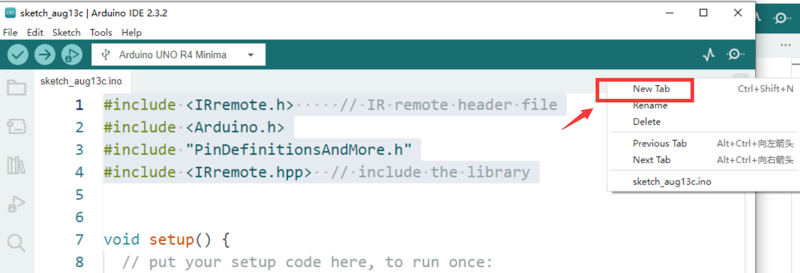
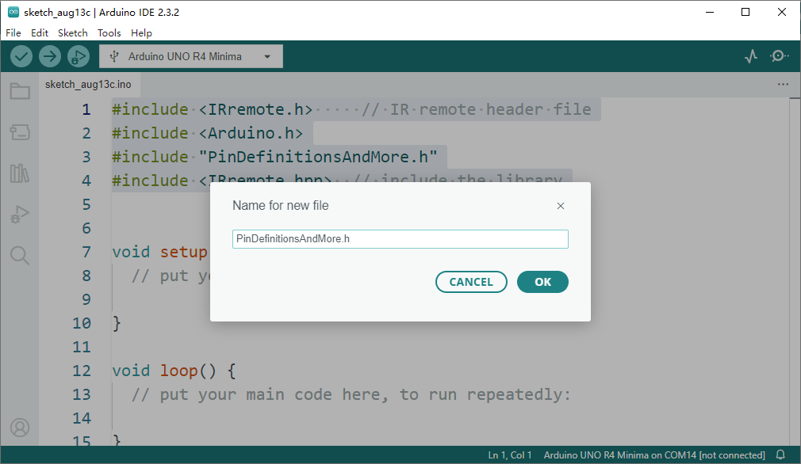
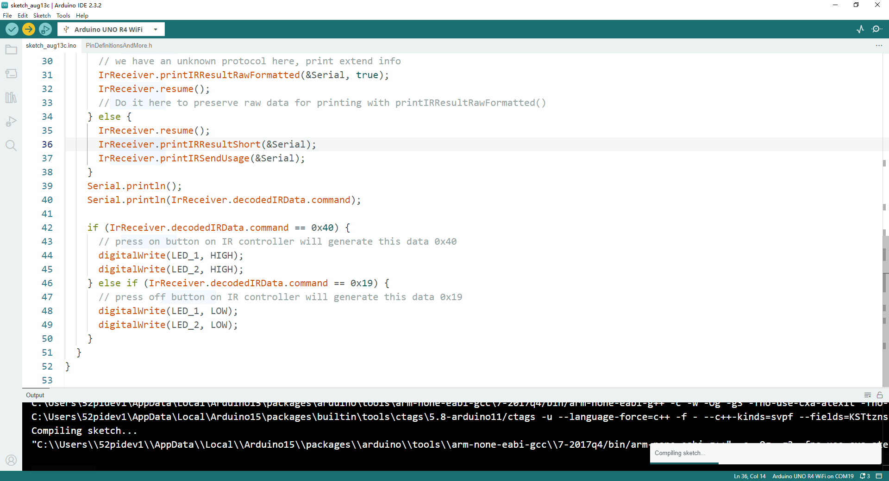
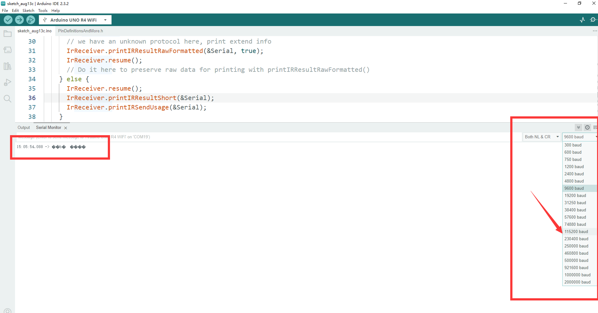
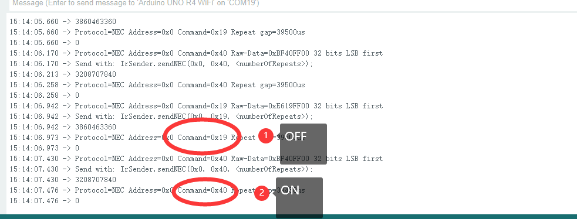

# Basic Usage 4

## IR contorler control LEDs 

Next, we will use the onboard IR receiver to receive signals from the infrared remote control to control the LED lights.

OK, let’s begin the basic learning. 

In this experiment, we are going to control the two LEDs on the plant watering hat board by using IR remote controller. 

## Hardware Overview

The shield provides the following interfaces:

* 3 x Soil Moisture Sensors (Analog Inputs A0, A1, A2)
* 3 x NTC Temperature Sensors (Analog Inputs A4, A5, A6)
* 3 x 3.3V Relay Modules (Digital Outputs 2, 3, 4)
* 3 x Mini Water Pumps
* 1 x 1.3-inch IPS RGB TFT Screen (ST7789 Controller)
* 1 x IR receiver 
* 1 x IR remote controller
<font color=red>NOTE: you may need to purchase battery for the IR remote controller. </font></br>

## IR Receiver position on board 

* IR receiver 

 

* IR remote controller

 


## Pinout Chart

* Details of the expansion board.

|Plant Watering Kit Hat Board | Arduino UNO R4 WiFi Board|
|:---:|:---:|
| <font color=Green>HUMI3 </font>| <font color=green>A0</font> |
| <font color=Green>HUMI2 </font>| <font color=green>A1</font> |
| <font color=Green>HUMI1 </font>| <font color=green>A2</font> |
| <font color=BROWN>TEMP3</font>| <font color=BROWN>A3</font> |
| <font color=BROWN>TEMP2</font>| <font color=BROWN>A4</font> |
| <font color=BROWN>TEMP1 </font>| <font color=BROWN>A5</font> |
| <font color=red>IR_RSV</font>| <font color=red>D5</font> |
| <font color=blue>Relay 1</font>| <font color=blue>D2</font> |
| <font color=blue>Relay 2</font>| <font color=blue>D3</font> |
| <font color=blue>Relay 3</font>| <font color=blue>D4</font> |
| <font color=pink> TFT_SCLK </font>| <font color=pink>D13 </font>|
| <font color=pink> TFT_MOSI</font>| <font color=pink>D11 </font>|
| <font color=pink> TFT_CS </font>| <font color=pink>D10 </font>|
| <font color=pink> TFT_DC </font>| <font color=pink>D9 </font>|
| <font color=pink> TFT_RST </font>| <font color=pink>D8 </font>|
| <font color=red> RX</font>| <font color=red>TX->1 </font>|
| <font color=red> TX</font>| <font color=red>RX<-0 </font>|
| <font color=green>Green LED </font>|<font color=green>D6</font> |
| <font color=red>Red LED</font> | <font color=red>D7</font> |

## Circuit Diagram 


## Connecting the Shield

- place the arduino uno r4 on a flat surface.
- align the shield with the headers of the arduino board and gently press it down until it clicks into place.
- plug the plant watering hat board on top of arduino uno r4 on gpio pins. 

## Programming 

Open arduino IDE and create a new sketch by clicking `file`-> `New Sketch` 


## Install IRRemote library 

* Click `book` icon to open library manager and then input `IRremote`, install
IRremote library as following figure.


### Import header files 

```bash
#include <IRremote.h>     // IR remote header file
#include <Arduino.h>
#include "PinDefinitionsAndMore.h"
#include <IRremote.hpp>  // include the library
```
NOTE: 
open a new tab on Arduino IDE by click three dots on right corner. 


next to create a new tab. 






and then copy following code and paste into it. 

```bash
/*
 *  PinDefinitionsAndMore.h
 *
 *  Contains pin definitions for IRremote examples for various platforms
 *  as well as definitions for feedback LED and tone() and includes
 *
 *  Copyright (C) 2021-2023  Armin Joachimsmeyer
 *  armin.joachimsmeyer@gmail.com
 *
 *  This file is part of IRremote https://github.com/Arduino-IRremote/Arduino-IRremote.
 *
 *  Arduino-IRremote is free software: you can redistribute it and/or modify
 *  it under the terms of the GNU General Public License as published by
 *  the Free Software Foundation, either version 3 of the License, or
 *  (at your option) any later version.
 *
 *  This program is distributed in the hope that it will be useful,
 *  but WITHOUT ANY WARRANTY; without even the implied warranty of
 *  MERCHANTABILITY or FITNESS FOR A PARTICULAR PURPOSE.
 *  See the GNU General Public License for more details.
 *
 *  You should have received a copy of the GNU General Public License
 *  along with this program. If not, see <http://www.gnu.org/licenses/gpl.html>.
 *
 */

/*
 * Pin mapping table for different platforms
 *
 * Platform     IR input    IR output   Tone      Core/Pin schema
 * --------------------------------------------------------------
 * DEFAULT/AVR  2           3           4         Arduino
 * ATtinyX5     0|PB0       4|PB4       3|PB3     ATTinyCore
 * ATtiny167    3|PA3       2|PA2       7|PA7     ATTinyCore
 * ATtiny167    9|PA3       8|PA2       5|PA7     Digispark original core
 * ATtiny84      |PB2        |PA4        |PA3     ATTinyCore
 * ATtiny88     3|PD3       4|PD4       9|PB1     ATTinyCore
 * ATtiny3217  18|PA1      19|PA2      20|PA3     MegaTinyCore
 * ATtiny1604   2           3|PA5       %
 * ATtiny816   14|PA1      16|PA3       1|PA5     MegaTinyCore
 * ATtiny1614   8|PA1      10|PA3       1|PA5     MegaTinyCore
 * SAMD21       3           4           5
 * ESP8266      14|D5       12|D6       %
 * ESP32        15          4          27
 * ESP32-C3     6           7          10
 * BluePill     PA6         PA7       PA3
 * APOLLO3      11          12          5
 * RP2040       3|GPIO15    4|GPIO16    5|GPIO17
 */
//#define _IR_MEASURE_TIMING // For debugging purposes.

#if defined(__AVR__)
#if defined(__AVR_ATtiny25__) || defined(__AVR_ATtiny45__) || defined(__AVR_ATtiny85__) // Digispark board. For use with ATTinyCore.
#include "ATtinySerialOut.hpp" // TX is at pin 2 - Available as Arduino library "ATtinySerialOut". Saves 700 bytes program memory and 70 bytes RAM for ATtinyCore.
#define IR_RECEIVE_PIN  PIN_PB0
#define IR_SEND_PIN     PIN_PB4 // Pin 2 is serial output with ATtinySerialOut. Pin 1 is internal LED and Pin3 is USB+ with pullup on Digispark board.
#define TONE_PIN        PIN_PB3
#define _IR_TIMING_TEST_PIN PIN_PB3

#  elif defined(__AVR_ATtiny87__) || defined(__AVR_ATtiny167__) // Digispark pro board
#include "ATtinySerialOut.hpp" // Available as Arduino library "ATtinySerialOut"
// For ATtiny167 Pins PB6 and PA3 are usable as interrupt source.
#  if defined(ARDUINO_AVR_DIGISPARKPRO)
// For use with Digispark original core
#define IR_RECEIVE_PIN   9 // PA3 - on Digispark board labeled as pin 9
//#define IR_RECEIVE_PIN  14 // PB6 / INT0 is connected to USB+ on DigisparkPro boards
#define IR_SEND_PIN      8 // PA2 - on Digispark board labeled as pin 8
#define TONE_PIN         5 // PA7 - on Digispark board labeled as pin 5
#define _IR_TIMING_TEST_PIN 10 // PA4
#  else
// For use with ATTinyCore
#define IR_RECEIVE_PIN  PIN_PA3 // On Digispark board labeled as pin 9 - INT0 is connected to USB+ on DigisparkPro boards
#define IR_SEND_PIN     PIN_PA2 // On Digispark board labeled as pin 8
#define TONE_PIN        PIN_PA7 // On Digispark board labeled as pin 5
#  endif

#  elif defined(__AVR_ATtiny84__) // For use with ATTinyCore
#include "ATtinySerialOut.hpp" // Available as Arduino library "ATtinySerialOut". Saves 128 bytes program memory.
#define IR_RECEIVE_PIN   PIN_PB2 // INT0
#define IR_SEND_PIN      PIN_PA4
#define TONE_PIN         PIN_PA3
#define _IR_TIMING_TEST_PIN PIN_PA5

#  elif defined(__AVR_ATtiny88__) // MH-ET Tiny88 board. For use with ATTinyCore.
#include "ATtinySerialOut.hpp" // Available as Arduino library "ATtinySerialOut". Saves 128 bytes program memory.
// Pin 6 is TX, pin 7 is RX
#define IR_RECEIVE_PIN   PIN_PD3 // 3 - INT1
#define IR_SEND_PIN      PIN_PD4 // 4
#define TONE_PIN         PIN_PB1 // 9
#define _IR_TIMING_TEST_PIN PIN_PB0 // 8

#  elif defined(__AVR_ATtiny1616__)  || defined(__AVR_ATtiny3216__) || defined(__AVR_ATtiny3217__) // For use with megaTinyCore
// Tiny Core Dev board
// https://www.tindie.com/products/xkimi/tiny-core-16-dev-board-attiny1616/ - Out of Stock
// https://www.tindie.com/products/xkimi/tiny-core-32-dev-board-attiny3217/ - Out of Stock
#define IR_RECEIVE_PIN   PIN_PA1 // use 18 instead of PIN_PA1 for TinyCore32
#define IR_SEND_PIN      PIN_PA2 // 19
#define TONE_PIN         PIN_PA3 // 20
#define APPLICATION_PIN  PIN_PA0 // 0
#undef LED_BUILTIN               // No LED available on the TinyCore 32 board, take the one on the programming board which is connected to the DAC output
#define LED_BUILTIN      PIN_PA6 // use 2 instead of PIN_PA6 for TinyCore32

#  elif defined(__AVR_ATtiny816__) // For use with megaTinyCore
#define IR_RECEIVE_PIN  PIN_PA1 // 14
#define IR_SEND_PIN     PIN_PA1 // 16
#define TONE_PIN        PIN_PA5 // 1
#define APPLICATION_PIN PIN_PA4 // 0
#undef LED_BUILTIN              // No LED available, take the one which is connected to the DAC output
#define LED_BUILTIN     PIN_PB5 // 4

#  elif defined(__AVR_ATtiny1614__) // For use with megaTinyCore
#define IR_RECEIVE_PIN   PIN_PA1 // 8
#define IR_SEND_PIN      PIN_PA3 // 10
#define TONE_PIN         PIN_PA5 // 1
#define APPLICATION_PIN  PIN_PA4 // 0

#  elif defined(__AVR_ATtiny1604__) // For use with megaTinyCore
#define IR_RECEIVE_PIN   PIN_PA6 // 2 - To be compatible with interrupt example, pin 2 is chosen here.
#define IR_SEND_PIN      PIN_PA7 // 3
#define APPLICATION_PIN  PIN_PB2 // 5

#define tone(...) void()      // Define as void, since TCB0_INT_vect is also used by tone()
#define noTone(a) void()
#define TONE_PIN         42 // Dummy for examples using it

#  elif defined(__AVR_ATmega1284__) || defined(__AVR_ATmega1284P__) \
|| defined(__AVR_ATmega644__) || defined(__AVR_ATmega644P__) \
|| defined(__AVR_ATmega324P__) || defined(__AVR_ATmega324A__) \
|| defined(__AVR_ATmega324PA__) || defined(__AVR_ATmega164A__) \
|| defined(__AVR_ATmega164P__) || defined(__AVR_ATmega32__) \
|| defined(__AVR_ATmega16__) || defined(__AVR_ATmega8535__) \
|| defined(__AVR_ATmega64__) || defined(__AVR_ATmega128__) \
|| defined(__AVR_ATmega1281__) || defined(__AVR_ATmega2561__) \
|| defined(__AVR_ATmega8515__) || defined(__AVR_ATmega162__)
#define IR_RECEIVE_PIN      2
#define IR_SEND_PIN        13
#define TONE_PIN            4
#define APPLICATION_PIN     5
#define ALTERNATIVE_IR_FEEDBACK_LED_PIN 6 // E.g. used for examples which use LED_BUILDIN for example output.
#define _IR_TIMING_TEST_PIN 7

#  else // Default as for ATmega328 like on Uno, Nano, Leonardo, Teensy 2.0 etc.
#define IR_RECEIVE_PIN      2 // To be compatible with interrupt example, pin 2 is chosen here.
#define IR_SEND_PIN         3
#define TONE_PIN            4
#define APPLICATION_PIN     5
#define ALTERNATIVE_IR_FEEDBACK_LED_PIN 6 // E.g. used for examples which use LED_BUILDIN for example output.
#define _IR_TIMING_TEST_PIN 7

#    if defined(ARDUINO_AVR_PROMICRO) // Sparkfun Pro Micro is __AVR_ATmega32U4__ but has different external circuit
// We have no built in LED at pin 13 -> reuse RX LED
#undef LED_BUILTIN
#define LED_BUILTIN         LED_BUILTIN_RX
#    endif
#  endif // defined(__AVR_ATtiny25__)...

#elif defined(ARDUINO_ARCH_RENESAS_UNO) // Uno R4
// To be compatible with Uno R3.
#define IR_RECEIVE_PIN      2
#define IR_SEND_PIN         3
#define TONE_PIN            4
#define APPLICATION_PIN     5
#define ALTERNATIVE_IR_FEEDBACK_LED_PIN 6 // E.g. used for examples which use LED_BUILDIN for example output.
#define _IR_TIMING_TEST_PIN 7

#elif defined(ESP8266)
#define FEEDBACK_LED_IS_ACTIVE_LOW // The LED on my board (D4) is active LOW
#define IR_RECEIVE_PIN          14 // D5
#define IR_SEND_PIN             12 // D6 - D4/pin 2 is internal LED
#define _IR_TIMING_TEST_PIN      2 // D4
#define APPLICATION_PIN         13 // D7

#define tone(...) void()      // tone() inhibits receive timer
#define noTone(a) void()
#define TONE_PIN                42 // Dummy for examples using it

#elif defined(CONFIG_IDF_TARGET_ESP32C3) || defined(ARDUINO_ESP32C3_DEV)
#define NO_LED_FEEDBACK_CODE   // The  WS2812 on pin 8 of AI-C3 board crashes if used as receive feedback LED, other I/O pins are working...
#define IR_RECEIVE_PIN           6
#define IR_SEND_PIN              7
#define TONE_PIN                10
#define APPLICATION_PIN         18

#elif defined(ESP32)
#include <Arduino.h>

// tone() is included in ESP32 core since 2.0.2
#if !defined(ESP_ARDUINO_VERSION_VAL)
#define ESP_ARDUINO_VERSION_VAL(major, minor, patch) 12345678
#endif
#if ESP_ARDUINO_VERSION  <= ESP_ARDUINO_VERSION_VAL(2, 0, 2)
#define TONE_LEDC_CHANNEL        1  // Using channel 1 makes tone() independent of receiving timer -> No need to stop receiving timer.
void tone(uint8_t aPinNumber, unsigned int aFrequency){
    ledcAttachPin(aPinNumber, TONE_LEDC_CHANNEL);
    ledcWriteTone(TONE_LEDC_CHANNEL, aFrequency);
}
void tone(uint8_t aPinNumber, unsigned int aFrequency, unsigned long aDuration){
    ledcAttachPin(aPinNumber, TONE_LEDC_CHANNEL);
    ledcWriteTone(TONE_LEDC_CHANNEL, aFrequency);
    delay(aDuration);
    ledcWriteTone(TONE_LEDC_CHANNEL, 0);
}
void noTone(uint8_t aPinNumber){
    ledcWriteTone(TONE_LEDC_CHANNEL, 0);
}
#endif // ESP_ARDUINO_VERSION  <= ESP_ARDUINO_VERSION_VAL(2, 0, 2)

#define IR_RECEIVE_PIN          15  // D15
#define IR_SEND_PIN              4  // D4
#define TONE_PIN                27  // D27 25 & 26 are DAC0 and 1
#define APPLICATION_PIN         16  // RX2 pin

#elif defined(ARDUINO_ARCH_STM32) || defined(ARDUINO_ARCH_STM32F1) // BluePill
// Timer 3 blocks PA6, PA7, PB0, PB1 for use by Servo or tone()
#define IR_RECEIVE_PIN          PA6
#define IR_RECEIVE_PIN_STRING   "PA6"
#define IR_SEND_PIN             PA7
#define IR_SEND_PIN_STRING      "PA7"
#define TONE_PIN                PA3
#define _IR_TIMING_TEST_PIN     PA5
#define APPLICATION_PIN         PA2
#define APPLICATION_PIN_STRING  "PA2"
#  if defined(ARDUINO_GENERIC_STM32F103C) || defined(ARDUINO_BLUEPILL_F103C8)
// BluePill LED is active low
#define FEEDBACK_LED_IS_ACTIVE_LOW
#  endif

#elif defined(ARDUINO_ARCH_APOLLO3) // Sparkfun Apollo boards
#define IR_RECEIVE_PIN  11
#define IR_SEND_PIN     12
#define TONE_PIN         5

#elif defined(ARDUINO_ARCH_MBED) && defined(ARDUINO_ARCH_MBED_NANO) // Arduino Nano 33 BLE
#define IR_RECEIVE_PIN      3   // GPIO15 Start with pin 3 since pin 2|GPIO25 is connected to LED on Pi pico
#define IR_SEND_PIN         4   // GPIO16
#define TONE_PIN            5
#define APPLICATION_PIN     6
#define ALTERNATIVE_IR_FEEDBACK_LED_PIN 7 // E.g. used for examples which use LED_BUILDIN for example output.
#define _IR_TIMING_TEST_PIN 8

#elif defined(ARDUINO_ARCH_RP2040) // Arduino Nano Connect, Pi Pico with arduino-pico core https://github.com/earlephilhower/arduino-pico
#define IR_RECEIVE_PIN      15  // GPIO15 to be compatible with the Arduino Nano RP2040 Connect (pin3)
#define IR_SEND_PIN         16  // GPIO16
#define TONE_PIN            17
#define APPLICATION_PIN     18
#define ALTERNATIVE_IR_FEEDBACK_LED_PIN 19 // E.g. used for examples which use LED_BUILDIN for example output.
#define _IR_TIMING_TEST_PIN 20

// If you program the Nano RP2040 Connect with this core, then you must redefine LED_BUILTIN
// and use the external reset with 1 kOhm to ground to enter UF2 mode
#undef LED_BUILTIN
#define LED_BUILTIN          6

#elif defined(PARTICLE) // !!!UNTESTED!!!
#define IR_RECEIVE_PIN      A4
#define IR_SEND_PIN         A5 // Particle supports multiple pins

#define LED_BUILTIN         D7

/*
 * 4 times the same (default) layout for easy adaption in the future
 */
#elif defined(TEENSYDUINO) // Teensy 2.0 is handled at default for ATmega328 like on Uno, Nano, Leonardo etc.
#define IR_RECEIVE_PIN      2
#define IR_SEND_PIN         3
#define TONE_PIN            4
#define APPLICATION_PIN     5
#define ALTERNATIVE_IR_FEEDBACK_LED_PIN 6 // E.g. used for examples which use LED_BUILDIN for example output.
#define _IR_TIMING_TEST_PIN 7

#elif defined(ARDUINO_ARCH_MBED) // Arduino Nano 33 BLE
#define IR_RECEIVE_PIN      2
#define IR_SEND_PIN         3
#define TONE_PIN            4
#define APPLICATION_PIN     5
#define ALTERNATIVE_IR_FEEDBACK_LED_PIN 6 // E.g. used for examples which use LED_BUILDIN for example output.
#define _IR_TIMING_TEST_PIN 7

#elif defined(ARDUINO_ARCH_SAMD) || defined(ARDUINO_ARCH_SAM)
#define IR_RECEIVE_PIN      2
#define IR_SEND_PIN         3
#define TONE_PIN            4
#define APPLICATION_PIN     5
#define ALTERNATIVE_IR_FEEDBACK_LED_PIN 6 // E.g. used for examples which use LED_BUILDIN for example output.
#define _IR_TIMING_TEST_PIN 7

#if !defined(ARDUINO_SAMD_ADAFRUIT) && !defined(ARDUINO_SEEED_XIAO_M0)
// On the Zero and others we switch explicitly to SerialUSB
#define Serial SerialUSB
#endif

// Definitions for the Chinese SAMD21 M0-Mini clone, which has no led connected to D13/PA17.
// Attention!!! D2 and D4 are swapped on these boards!!!
// If you connect the LED, it is on pin 24/PB11. In this case activate the next two lines.
//#undef LED_BUILTIN
//#define LED_BUILTIN 24 // PB11
// As an alternative you can choose pin 25, it is the RX-LED pin (PB03), but active low.In this case activate the next 3 lines.
//#undef LED_BUILTIN
//#define LED_BUILTIN 25 // PB03
//#define FEEDBACK_LED_IS_ACTIVE_LOW // The RX LED on the M0-Mini is active LOW

#elif defined (NRF51) // BBC micro:bit
#define IR_RECEIVE_PIN      2
#define IR_SEND_PIN         3
#define APPLICATION_PIN     1
#define _IR_TIMING_TEST_PIN 4

#define tone(...) void()    // no tone() available
#define noTone(a) void()
#define TONE_PIN           42 // Dummy for examples using it

#else
#warning Board / CPU is not detected using pre-processor symbols -> using default values, which may not fit. Please extend PinDefinitionsAndMore.h.
// Default valued for unidentified boards
#define IR_RECEIVE_PIN      2
#define IR_SEND_PIN         3
#define TONE_PIN            4
#define APPLICATION_PIN     5
#define ALTERNATIVE_IR_FEEDBACK_LED_PIN 6 // E.g. used for examples which use LED_BUILDIN for example output.
#define _IR_TIMING_TEST_PIN 7
#endif // defined(ESP8266)

#if defined(ESP32) || defined(ARDUINO_ARCH_RP2040) || defined(PARTICLE) || defined(ARDUINO_ARCH_MBED)
#define SEND_PWM_BY_TIMER // We do not have pin restrictions for this CPU's, so lets use the hardware PWM for send carrier signal generation
#else
# if defined(SEND_PWM_BY_TIMER)
#undef IR_SEND_PIN // SendPin is determined by timer! This avoids warnings in IRremote.hpp and IRTimer.hpp
#  endif
#endif

#if !defined (FLASHEND)
#define FLASHEND 0xFFFF // Dummy value for platforms where FLASHEND is not defined
#endif
#if !defined (RAMEND)
#define RAMEND 0xFFFF // Dummy value for platforms where RAMEND is not defined
#endif
#if !defined (RAMSIZE)
#define RAMSIZE 0xFFFF // Dummy value for platforms where RAMSIZE is not defined
#endif

/*
 * Helper macro for getting a macro definition as string
 */
#if !defined(STR_HELPER)
#define STR_HELPER(x) #x
#define STR(x) STR_HELPER(x)
#endif
```
### Define IR receiver and LEDs Pin number 

```bash
#define IR_RECEIVE_PIN 5
#define DECODE_NEC

// define LED indicators on board
#define LED_1 6     // Green LED 
#define LED_2 7     // Red LED

```

### Initializing Pin Mode 

Set the pin direction to `OUTPUT` in setup function sector.

```bash
void setup() {

    Serial.begin(115200); // note the baudrate is changed to 115200 

    // enable IR 
    IrReceiver.begin(IR_RECEIVE_PIN, ENABLE_LED_FEEDBACK);

    printActiveIRProtocols(&Serial);

    pinMode(LED_1, OUTPUT);
    pinMode(LED_2, OUTPUT);
}
```

### Modify loop section 

```bash
void loop() {
  if (IrReceiver.decode()) {
    /*
      * print a summary of received data
      */
    if (IrReceiver.decodedIRData.protocol == UNKNOWN) {
      Serial.println(F("Received noise or an unknown (or not yet enabled )protocol"));
      // we have an unknown protocol here, print extend info
      IrReceiver.printIRResultRawFormatted(&Serial, true);
      IrReceiver.resume();
      // Do it here to preserve raw data for printing with printIRResultRawFormatted()
    } else {
      IrReceiver.resume();
      IrReceiver.printIRResultShort(&Serial);
      IrReceiver.printIRSendUsage(&Serial);
    }
    Serial.println();
    Serial.println(IrReceiver.decodedIRData.command);

    if (IrReceiver.decodedIRData.command == 0x40) {
      // press on button on IR controller will generate this data 0x40
      digitalWrite(LED_1, HIGH);
      digitalWrite(LED_2, HIGH);
    } else if (IrReceiver.decodedIRData.command == 0x19) {
      // press off button on IR controller will generate this data 0x19
      digitalWrite(LED_1, LOW);
      digitalWrite(LED_2, LOW);
    }
  }
}
```

### Demo code examples 

```bash
#include <IRremote.h>  // IR remote header file
#include <Arduino.h>
#include "PinDefinitionsAndMore.h"
#include <IRremote.hpp>  // include the library

#define IR_RECEIVE_PIN 5
#define DECODE_NEC

// define LED indicators on board
#define LED_1 6
#define LED_2 7


void setup() {
  Serial.begin(115200);

  // enable IR
  IrReceiver.begin(IR_RECEIVE_PIN, ENABLE_LED_FEEDBACK);

  printActiveIRProtocols(&Serial);
}

void loop() {
  if (IrReceiver.decode()) {
    /*
     * print a summary of received data
     */

    if (IrReceiver.decodedIRData.protocol == UNKNOWN) {
      Serial.println(F("Received noise or an unknown (or not yet enabled )protocol"));
      // we have an unknown protocol here, print extend info
      IrReceiver.printIRResultRawFormatted(&Serial, true);
      IrReceiver.resume();
      // Do it here to preserve raw data for printing with printIRResultRawFormatted()

    } else {
      IrReceiver.resume();
      IrReceiver.printIRResultShort(&Serial);
      IrReceiver.printIRSendUsage(&Serial);
    }
    Serial.println();
    Serial.println(IrReceiver.decodedIRData.command);

    if (IrReceiver.decodedIRData.command == 0x40) {
      // press on button on IR controller will generate this data 0x40
      digitalWrite(LED_1, HIGH);
      digitalWrite(LED_2, HIGH);
    } else if (IrReceiver.decodedIRData.command == 0x19) {
      // press off button on IR controller will generate this data 0x19
      digitalWrite(LED_1, LOW);
      digitalWrite(LED_2, LOW);
    }
  }
}

```
Try to press `on` and `off` button on IR remote controller and observe the LED
indicators' status on board. 

### Upload the sketch to Arduino UNO R4 WiFi board.

* Connect the Arduino UNO R4 WiFi board to your computer via USB-C cable on USB port 

* Select the serial device on your arduino IDE and click upload icon as following figure:

 

### Open serial monitor and observe it.


Do remember change baudrate to `115200`. 



Serial monitor output:



You may try to modify the code in loop section to change the behavior of the LED indicators. 

## Demo Code Sketch Download 

* [Basic_4_IR_Remote_control_LEDs](./imgs/Basic_4_IR_Remote_control_LEDs.zip)

## Demo Video


----

### Finally 
* Try to press `on` and `off` button on IR remote controller and observe the LED
* If you can see the LED lights are controlling by IR remote controller means that you have finished this
task. Let us remove to next chapter. 


