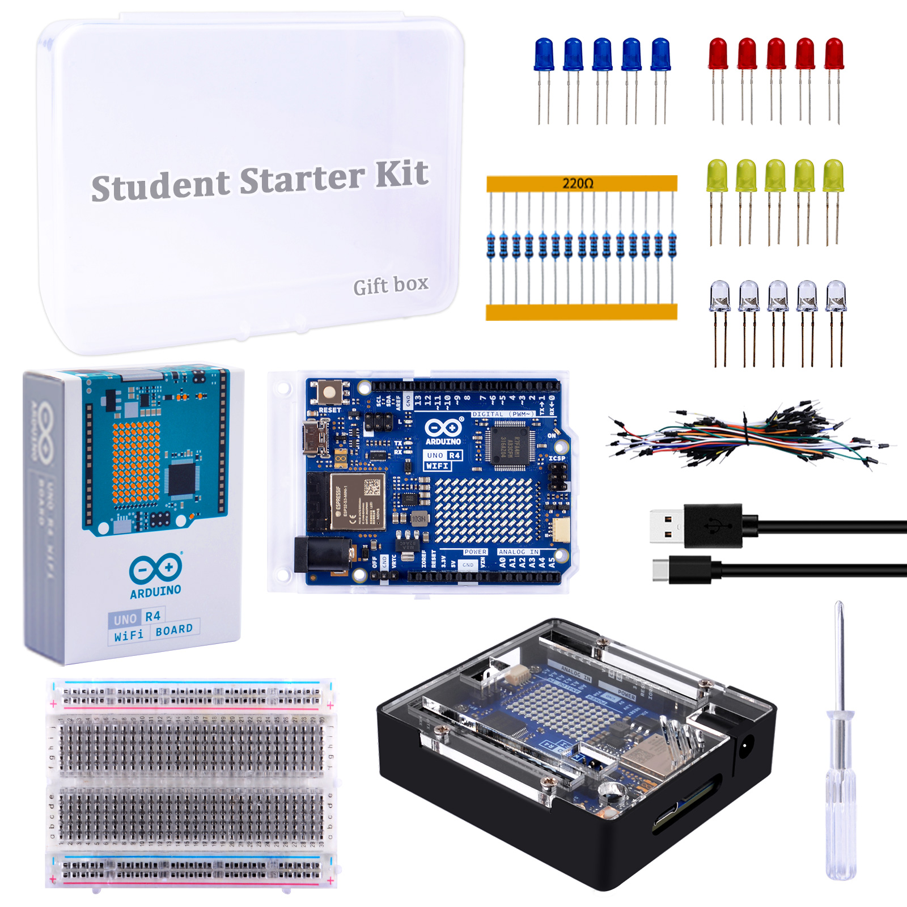
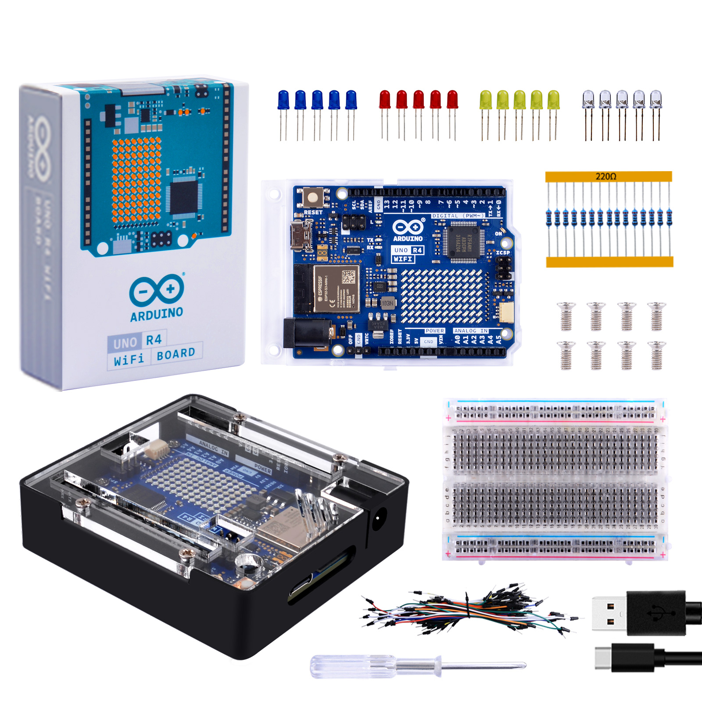

# Student starter kit 

## Product information

* Product Name: Student starter kit 
* Product SKU: KZ-0077

###  About this item 

This is a student entry level kit designed for Arduino Uno R4
The case is a two-piece metal shell that snaps around the Arduino. It holds the Arduino firmly in place
It provides solid protection for the Arduino UNO while providing access to all Arduino connectors.
Cutouts for Arduino UNO R4 connectors – compatible with UNO R4 WiFi and UNO R4 Minima
Comes with USB Type-C cable for Arduino Uno R4

400 Points Breadboard with 2 Positive & Negative Power Lines on both ends.Perfect for Arduino Shield Prototyping and Testing.
5mm LED Diodes Kit：5mm LED Diodes Kit – Includes 20 Pcs 5mm Led lights in a variety of colors.
Application -- These LED lights perfect forDIY LED Projects, School Science Experiments, 
Safe and secure pakcage: all components are well-stored in a sturdy box

## Description

The Arduino UNO R4 WiFi Student Starter Kit is an entry-level set designed to introduce students to the world of Arduino development boards. 
This kit includes an Arduino UNO R4 WiFi board, a metal case, an acrylic cover, and an LED light package. It also contains jumper wires and a breadboard, which are essential for prototyping and experimenting with various electronic components .

### Features

- **Metal Case and Acrylic Cover**: Provides protection and a polished look to the board.
- **LED Light Package**: Includes a variety of LEDs for learning and experimenting with lighting and indicators.
- **Jumper Wires and Breadboard**: Essential tools for connecting components in a circuit without soldering.
- **WiFi Connectivity**: The board features an ESP32-S3 module for Wi-Fi and Bluetooth connectivity, enabling IoT projects.
- **User-friendly**: Suited for beginners with its straightforward setup and use.
- **Cost-effective**: Offers great value for money, making it an ideal choice for students and hobbyists.

### Specification

- **Microcontroller**: Renesas RA4M1 (Arm Cortex-M4) with a 48 MHz clock speed.
- **Memory**: 256 kB flash memory and 32 kB SRAM.
- **Digital I/O Pins**: 14 digital input/output pins.
- **Analog Input Pins**: 6 analog input pins.
- **PWM Channels**: 6 PWM pins for analog signal creation.
- **Communication**: USB-C programming port, UART, SPI, I2C, CAN.
- **Power Supply**: Operates on 5V, with input voltage (VIN) supporting 6-24V.
- **USB Serial**: Two separate hardware serial ports for communication.
- **LED Matrix**: A 12x8 LED matrix for dynamic displays.
- **Real-Time Clock (RTC)**: For timekeeping in projects.
- **Digital-to-Analog Converter (DAC)**: 12-bit DAC for high-quality analog output.
- **Qwiic/STEMMA Connector**: For easy connection of I2C modules.
- **Dimensions**: 68.85 mm x 53.34 mm.

This kit is a comprehensive starting point for anyone looking to get into Arduino and IoT projects, providing both the hardware and the connectivity needed for a wide range of applications.

## Product Outlook

* What is inside the package? 

* Metal case 

* Unique design for Arduino R4 series 

* Port definitions 

* Pinout of Arduino UNO R4 Wifi 

* Main feature

* Slots for GPIO Pins 

## How to assemble it? 

## Package List 

## Getting Starter
[Getting Start](../kz-0073/getting-start.md)
