# Ultimate Starter Kit for Raspberry Pi Pico 2 WH 

## Product Information 

* Product Name: Ultimate Starter Kit for Raspberry Pi Pico 2 WH 

* Product SKU: KZ-0084

## Product Description

Congratulations on purchasing the 52Pi Raspberry Pi Pico 2W Ultimate Starter Kit! This comprehensive kit is designed for beginners, educators, and hobbyists who want to explore the world of electronics and programming with the powerful Raspberry Pi Pico 2W microcontroller.

## Kit Components

Our Ultimate Starter Kit includes a variety of sensors and components to help you learn and experiment:

| Item | Description | Quantity |
|:----:|:-----------:|:--------:|
| Raspberry Pi Pico 2 WH | A WiFi-enabled microcontroller board with headers soldered on | 1 |
| LED Indicator | Red, white, blue, and yellow LEDs (5 each) | 20 |
| 220ohm Resistor | Red, white, blue, and yellow resistors (5 each) | 20 |
| Push button | Tactile buttons with caps | 5 |
| Buzzer | Audible alert component | 2 |
| Long Breadboard | 800-hole breadboard for prototyping | 1 |
| Flame Sensor | Detects flame or heat sources | 1 |
| Rain Sensor | Detects water or moisture | 1 |
| Servo | Standard servo motor for mechanical control | 1 |
| Soil Moisture Sensor | Measures soil moisture levels | 1 |
| Light Sensor | Detects light intensity | 1 |
| Sound Sensor | Detects sound levels | 1 |
| Tilt Sensor | Detects changes in orientation | 1 |
| Ultrasonic Sensor | Measures distance using ultrasonic waves | 1 |
| Slid Pot HW-233 | Variable resistor for analog input | 1 |
| PS2 Joystick | Analog joystick for user input | 1 |
| Rotate Encoder | Rotational encoder for precise input | 1 |
| MicroUSB Programming Cable | Cable for programming and power supply | 1 |
| Dupont Jump Wire (Male-to-Female) | For connecting components to the breadboard | 40 |
| Dupont Jump Wire (Male-to-Male) | For connecting components to the breadboard | 40 |
| Resistor Color Code Chart | Reference chart for resistor values | 1 |
| Plastic Box | Storage box for organizing components | 1 |
| Instruction Manual | Comprehensive guide to get you started | 1 |

## Features

- **Comprehensive Learning Tool**: Provides hands-on experience with different types of sensors and electronic components
- **Easy to Use**: Clear documentation and straightforward connections make it accessible for beginners
- **Versatile Projects**: Create a wide range of projects from simple LED blinking to complex environmental monitoring systems
- **Educational Resource**: Perfect for schools, makerspaces, and self-learners
- **Well-organized Components**: All parts are carefully selected and tested for compatibility with Raspberry Pi Pico 2W

## Getting Started

1. **Connect Components**: Use the included DuPont wires to connect sensors to the breadboard and then to your Raspberry Pi Pico 2W
2. **Upload Code**: Use Thonny or another MicroPython-compatible IDE to upload example code to your Pico
3. **Experiment and Learn**: Modify the code and connections to explore different functionalities

## Who Should Use This Kit

- **Beginners**: Those new to electronics and programming who want to learn through hands-on experimentation
- **Educators**: Teachers looking for engaging STEM teaching tools
- **Hobbyists**: DIY enthusiasts interested in creating interactive projects
- **Makers**: Creators developing prototypes for innovative IoT devices

## Additional Resources

For detailed tutorials, wiring diagrams, technical explanations, and MicroPython demo codes for each component, please visit our official documentation website: [52Pi Docs](https://docs.52pi.com)

Our website also offers video demonstrations to guide you through each experiment step-by-step.

## Getting Start 

* [Install Programming IDE][1]
* [Download the latest MicroPython Firmware][2]
* [Put Your Pico 2 WH into Bootloader Mode][3]
* [Flash the MicroPython Firmware][4]
* [Configure Thonny IDE to Work with Pico 2 WH][5]
* [Testing Your Setup][6]

[1]: https://docs.52pi.com/md/kz-0083/getting-start/#install-programming-ide
[2]: https://docs.52pi.com/md/kz-0083/getting-start/#step-2-download-the-latest-micropython-firmware
[3]: https://docs.52pi.com/md/kz-0083/getting-start/#step-3-put-your-pico-2-wh-into-bootloader-mode
[4]: https://docs.52pi.com/md/kz-0083/getting-start/#step-4-flash-the-micropython-Firmware
[5]: https://docs.52pi.com/md/kz-0083/getting-start/#step-5-configure-thonny-ide-to-work-with-pico-2-wh 
[6]: https://docs.52pi.com/md/kz-0083/getting-start/#step-6-testing-your-setup 

## Demo Projects 
* [Experiment 1: Blinking a LED][11]
* [Experiment 2: Reading a Flame Sensor][12]
* [Experiment 3: Measuring Soil Moisture][13]
* [Experiment 4: Controlling a Servo Motor][14]
* [Experiment 5: Measuring Distance with an Ultrasonic Sensor][15]
* [Experiment 6: Detecting Light Intensity with a Light Sensor][16]
* [Experiment 7: Control the duration of led by using HW-233 slid pot][17]
* [Experiment 8: Detecting Sound with a Sound Sensor][18]
* [Experiment 9: Controlling a Buzzer][19]
* [Experiment 10: Using a Rotary Encoder][20]
* [Experiment 11: 1.3inch IPS_LCD display][21]
* [Experiment 12: 1.3inch IPS_LCD display imagebox][22]

## Experiment 1: Blinking a LED

#### Application Scenario
Create a simple LED blinker to signal an event, such as a heartbeat monitor or a warning indicator.

#### Working Principle

The LED is connected to one of the GPIO pins of the Pico 2 WH. By toggling the pin's voltage between HIGH and LOW, the LED will turn on and off.

#### Circuit Wiring

1. Connect the longer leg (anode) of the LED to GPIO pin 15.
2. Connect the shorter leg (cathode) of the LED to a 220Ω resistor.
3. Connect the other end of the resistor to the GND pin on the Pico 2 WH.

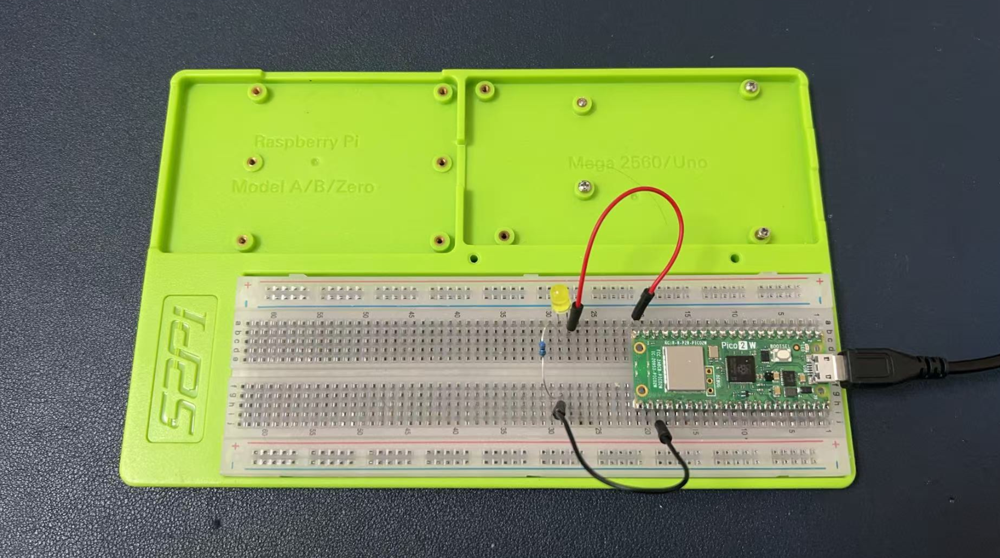


#### MicroPython Demo Code

```python
from machine import Pin
import time

# Define the GPIO pin connected to the LED
led = Pin(15, Pin.OUT)

while True:
    led.value(1)  # Turn on the LED
    time.sleep(1)  # Wait for 1 second
    led.value(0)  # Turn off the LED
    time.sleep(1)  # Wait for 1 second
```

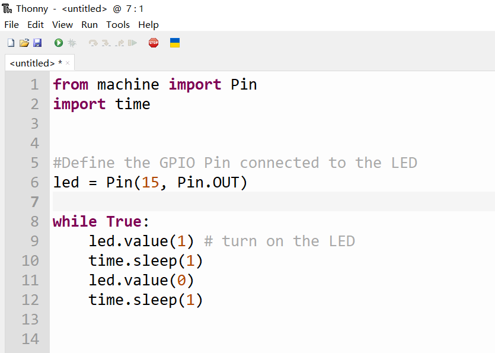

#### Code Explanation

* **Pin(15, Pin.OUT)**: Initializes GPIO pin 15 as an output pin.
* **led.value(1)**: Sets the pin to HIGH, turning on the LED.
* **time.sleep(1)**: Pauses the program for 1 second.
* **led.value(0)**: Sets the pin to LOW, turning off the LED.


## Experiment 2: Reading a Flame Sensor

#### Application Scenario

Detect the presence of fire or flame in a room for a safety monitoring system.

#### Working Principle

The flame sensor detects infrared light emitted by flames and outputs a digital signal (HIGH or LOW) based on the presence of fire.

#### Circuit Wiring

* Connect the VCC pin of the flame sensor to the 3.3V pin on the Pico 2 WH.
* Connect the GND pin of the flame sensor to the GND pin on the Pico 2 WH.
* Connect the OUT pin of the flame sensor to GPIO pin 14 on the Pico 2 WH.

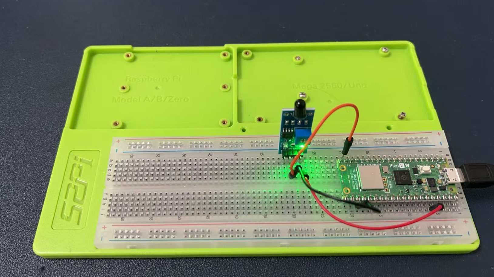

#### MicroPython Demo Code 

```Python

from machine import Pin
import time

# Define the GPIO pin connected to the flame sensor
flame_sensor = Pin(14, Pin.IN)

while True:
    if flame_sensor.value() == 1:
        print("Flame detected!")
    else:
        print("No flame detected.")
    time.sleep(0.5)
```

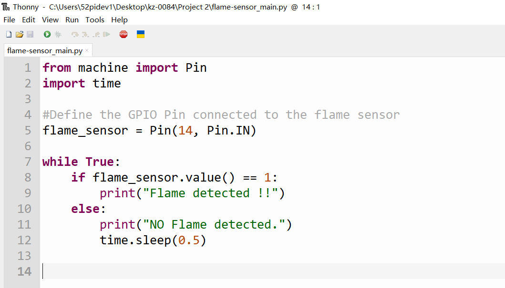

#### Code Explanation

* **Pin(14, Pin.IN)**: Initializes GPIO pin 14 as an input pin.
* **flame_sensor.value()**: Reads the digital value from the flame sensor (1 for flame detected, 0 for no flame).
* **print()**: Outputs the result to the console.

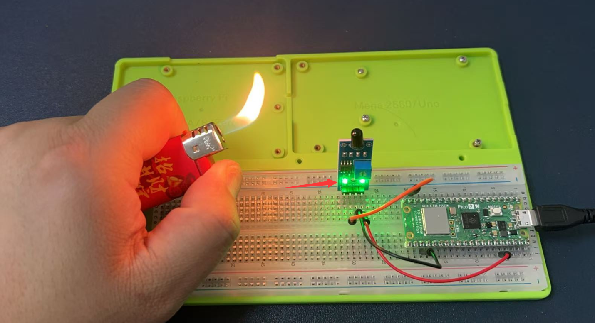

> NOTE: 
Please note that when using a lighter, be sure to prevent fires. If minors are to use it, they must be accompanied by an adult.

The detection accuracy and trigger level of the sensor can be adjusted using screws. By using a screwdriver to adjust the potentiometer, turn it until the trigger LED turns off. At this point, the sensitivity has been properly adjusted. You just need to turn on the lighter, and the LED will light up.

## Experiment 3: Measuring Soil Moisture

#### Application Scenario
Monitor the moisture level of a plant's soil to automate watering.

#### Working Principle
The soil moisture sensor measures the conductivity of the soil. Higher conductivity indicates more moisture.

#### Circuit Wiring

* Connect the VCC pin of the soil moisture sensor to the 3.3V pin on the Pico 2 WH.
* Connect the GND pin of the sensor to the GND pin on the Pico 2 WH.
* Connect the OUT pin of the sensor to GPIO pin 13 on the Pico 2 WH.

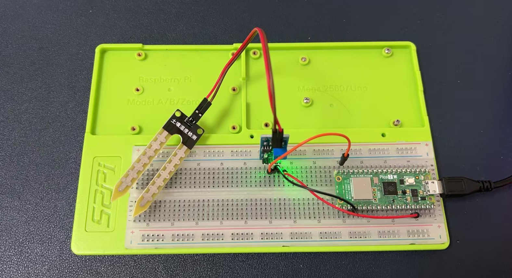

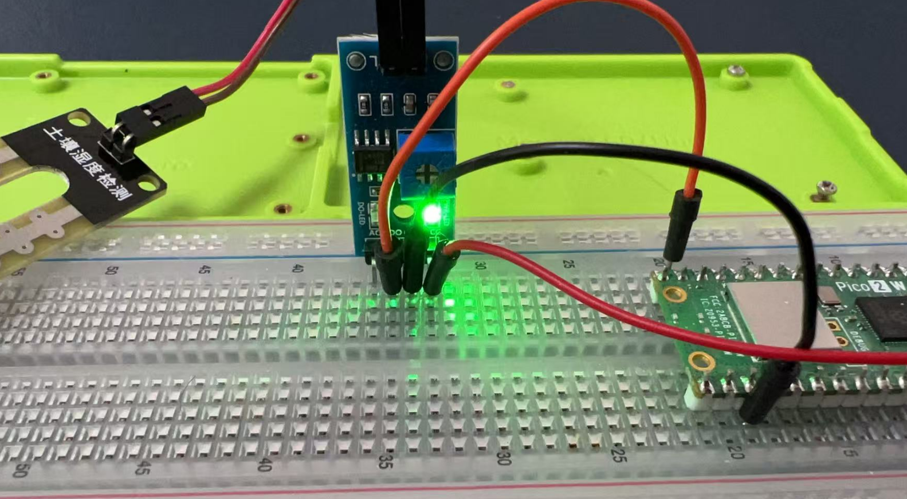

#### MicroPython Demo Code

```Python
from machine import Pin
import time

# Define the GPIO pin connected to the soil moisture sensor
soil_sensor = Pin(13, Pin.IN)

while True:
    if soil_sensor.value() == 1:
        print("Soil is dry.")
    else:
        print("Soil is moist.")
    time.sleep(1)
```

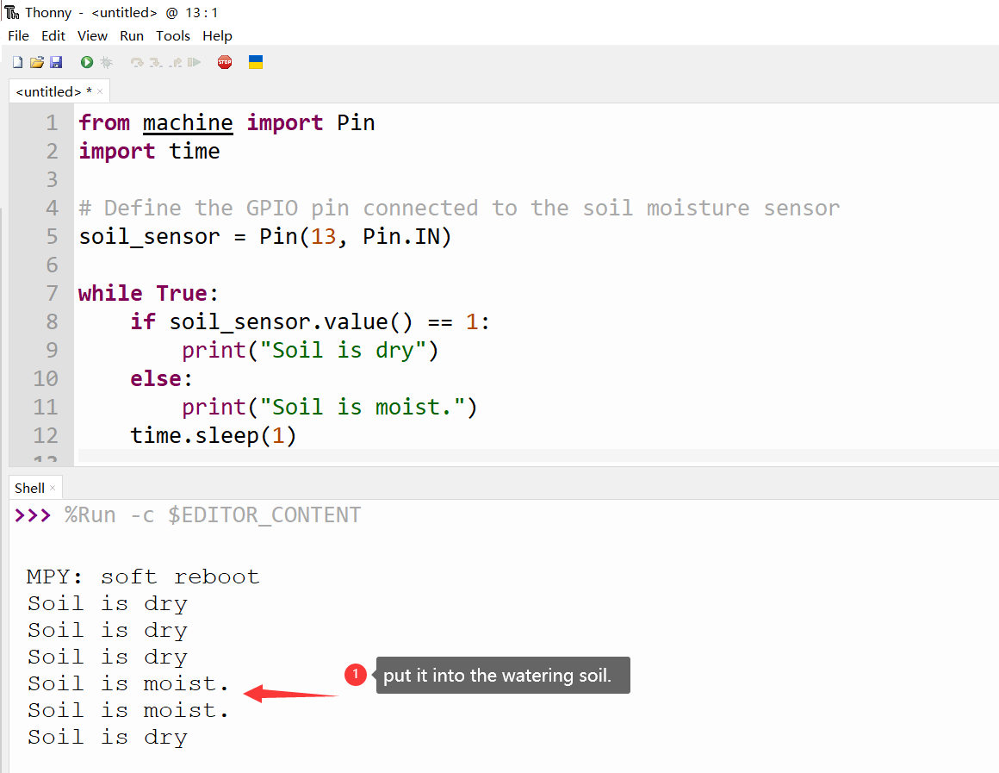

#### Code Explanation

* **Pin(13, Pin.IN)**: Initializes GPIO pin 13 as an input pin.
* **soil_sensor.value()**: Reads the digital value from the soil moisture sensor (1 for dry soil, 0 for moist soil).
* **print()**: Outputs the moisture status to the console.

Test it with wet paper:

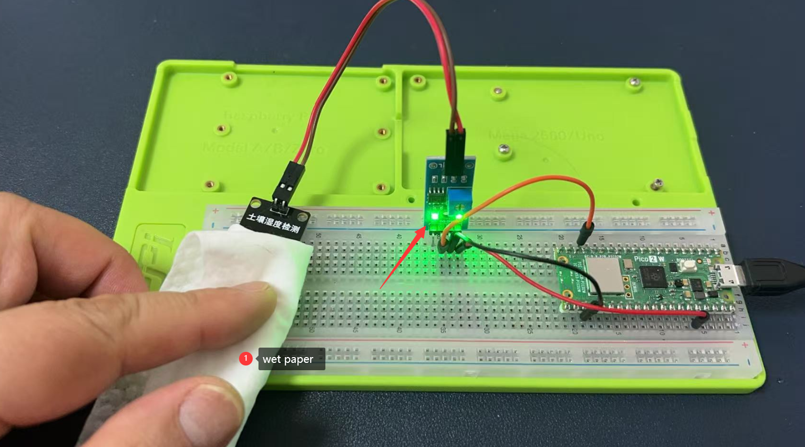

Monit the shell outputs: 


## Experiment 4: Controlling a Servo Motor

#### Application Scenario

Control a robotic arm or a small mechanical device using the servo motor.

#### Working Principle

The servo motor is controlled by a PWM (Pulse Width Modulation) signal. The position of the servo is determined by the duration of the pulse.

#### Circuit Wiring

* Connect the VCC pin of the servo to the 5V(VBUS) pin on the Pico 2 WH.
* Connect the GND pin of the servo to the GND pin on the Pico 2 WH.
* Connect the signal pin of the servo to GPIO pin 12 on the Pico 2 WH.

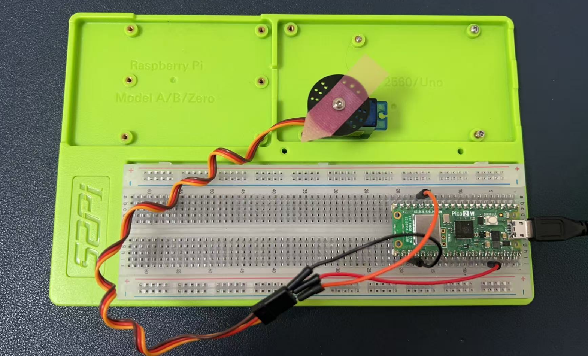

#### MicroPython Demo Code
* Step 1. Create a folder in `/lib` folder and named it `servo` on your raspberry Pi pico 2w.

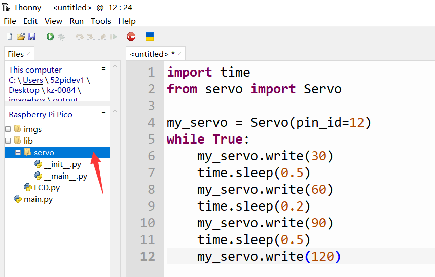

* Step 2. Create a new file in `/lib/servo/` and named it `__init__.py`, and copy
   following code and paste it into the file.

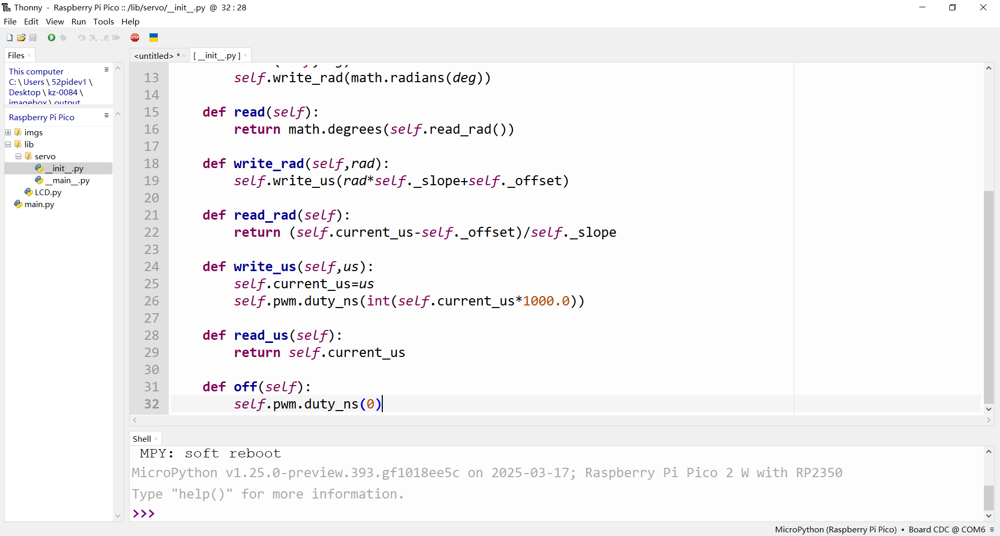

Code content: 
```Python
import machine
import math

class Servo:
    def __init__(self,pin_id,min_us=544.0,max_us=2400.0,min_deg=0.0,max_deg=180.0,freq=50):
        self.pwm = machine.PWM(machine.Pin(pin_id))
        self.pwm.freq(freq)
        self.current_us = 0.0
        self._slope = (min_us-max_us)/(math.radians(min_deg)-math.radians(max_deg))
        self._offset = min_us

    def write(self,deg):
        self.write_rad(math.radians(deg))

    def read(self):
        return math.degrees(self.read_rad())

    def write_rad(self,rad):
        self.write_us(rad*self._slope+self._offset)

    def read_rad(self):
        return (self.current_us-self._offset)/self._slope

    def write_us(self,us):
        self.current_us=us
        self.pwm.duty_ns(int(self.current_us*1000.0))

    def read_us(self):
        return self.current_us

    def off(self):
        self.pwm.duty_ns(0)

```

* Step 3. Create a new file in `/lib/servo/` and named it `__main__.py` and keep it
   empty as following figure:


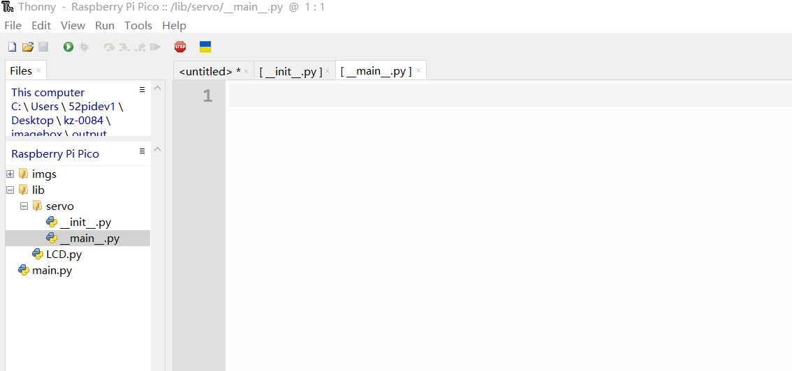

### Demo Code 

```Python
import time
from servo import Servo

my_servo = Servo(pin_id=12)
while True:
    my_servo.write(30)
    time.sleep(2)
    my_servo.write(60)
    time.sleep(2)
    my_servo.write(30)
    time.sleep(2)
    my_servo.write(180)
    time.sleep(2)
```
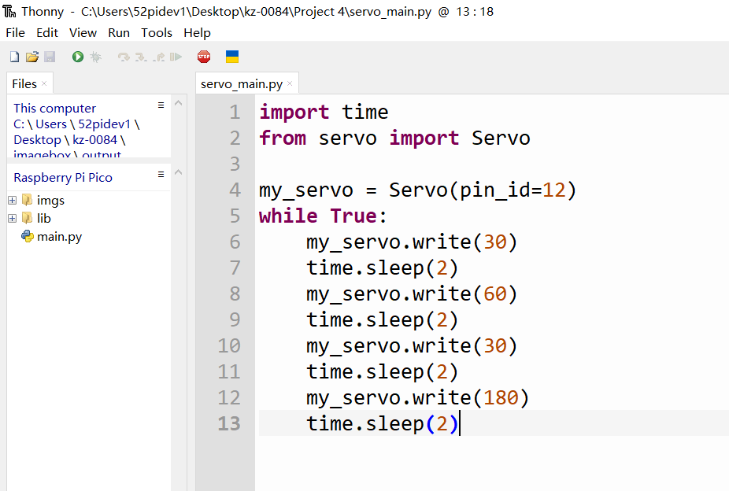

#### Code Explanation

* **Servo(Pin_id=12)**: Initializes GPIO pin 12 as a Servo.
* **my_servo.write(30)**: Sets the angle to control the servo position (30 for 30°, 90 for 90°, 180 for 180°).
* **time.sleep(2)**: Pauses the program for 2 second.


## Experiment 5: Measuring Distance with an Ultrasonic Sensor

#### Application Scenario

Measure the distance to an object for applications like obstacle detection in robotics.

#### Working Principle

The ultrasonic sensor emits a sound wave and measures the time it takes for the echo to return. The distance is calculated using the speed of sound.

#### Circuit Wiring

* Connect the VCC pin of the ultrasonic sensor to the 5V(VBUS) pin on the Pico 2 WH.
* Connect the GND pin of the sensor to the GND pin on the Pico 2 WH.
* Connect the TRIG pin of the sensor to GPIO pin 11 on the Pico 2 WH.
* Connect the ECHO pin of the sensor to GPIO pin 10 on the Pico 2 WH.

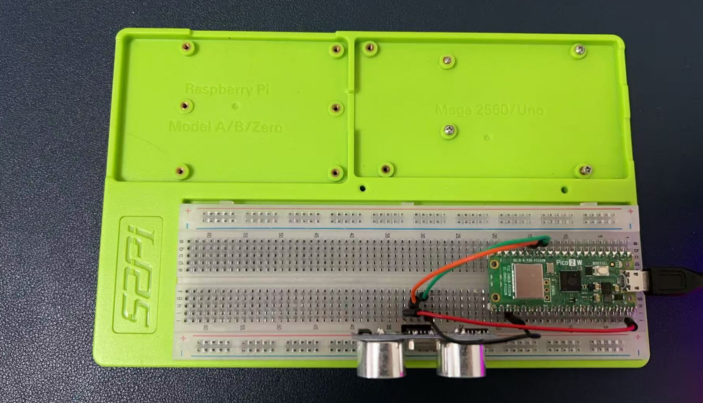

#### MicroPython Demo Code

```Python
from machine import Pin, time_pulse_us
import time

# Define GPIO pins connected to the ultrasonic sensor
trig = Pin(11, Pin.OUT)
echo = Pin(10, Pin.IN)

while True:
    trig.value(0)
    time.sleep_us(2)
    trig.value(1)
    time.sleep_us(10)
    trig.value(0)
    
    pulse_time = time_pulse_us(echo, 1)
    distance = pulse_time * 0.034 / 2  # Speed of sound = 340 m/s
    print(f"Distance: {distance:.2f} cm")
    time.sleep(1)
```

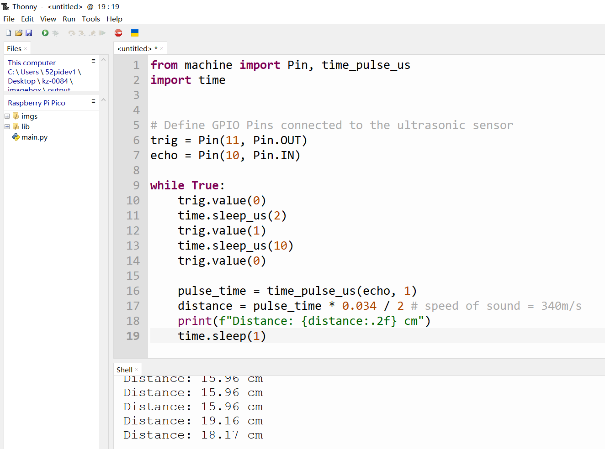

#### Code Explanation
* **trig.value(1)**: Sends a short pulse to the TRIG pin to start the measurement.
* **time_pulse_us(echo, 1)**: Measures the duration of the ECHO pulse in microseconds.
* **distance = pulse_time * 0.034 / 2**: Calculates the distance in centimeters.
* **print()**: Outputs the distance to the console.

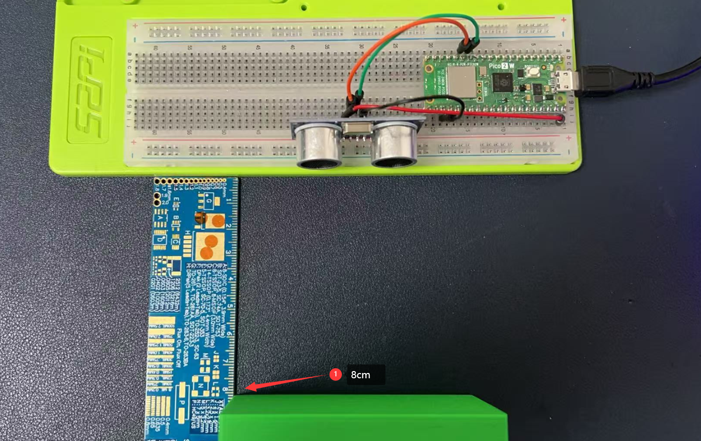

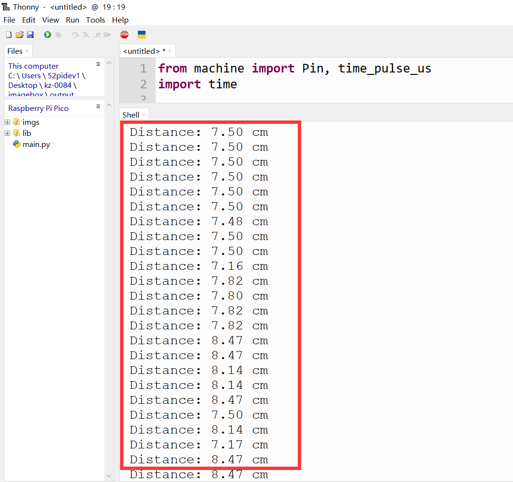

## Experiment 6: Detecting Light Intensity with a Light Sensor

#### Application Scenario

Create an automatic lighting system that turns on when the ambient light is too low.

#### Working Principle

The light sensor detects the intensity of ambient light and outputs a digital
level 0 or 1. 

#### Circuit Wiring

1. Connect the VCC pin of the light sensor to the 3.3V pin on the Pico 2 WH.
2. Connect the GND pin of the sensor to the GND pin on the Pico 2 WH.
3. Connect the OUT pin of the sensor to GPIO pin 16 on the Pico 2 WH.

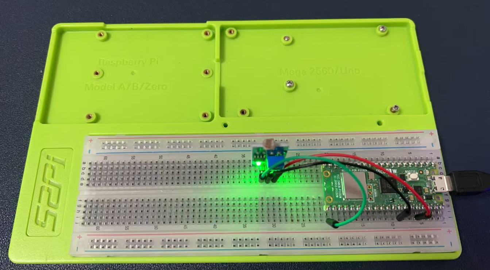

#### MicroPython Demo Code

```python

from machine import Pin
import time

# Define the pin connected to the light sensor
light_sensor = Pin(16, Pin.IN)

while True:
    if light_sensor.value() == 1:
        print("No light detect...")
    else:
        print("Light detected...")
    time.sleep(1)
```

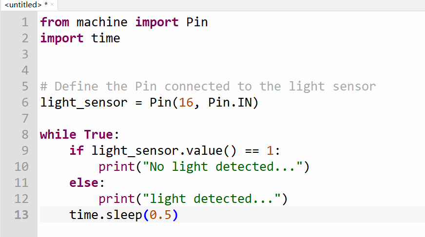

#### Code Explanation

- `Pin(16, Pin.OUT)`: Initializes GPIO pin 16 as an digital input.
- `1`: Light detected, `0`: no light detected. 
- `print()`: Outputs the light level to the console.

when you cover the light sensor, the output will change, think about which
scenario can use this module? 

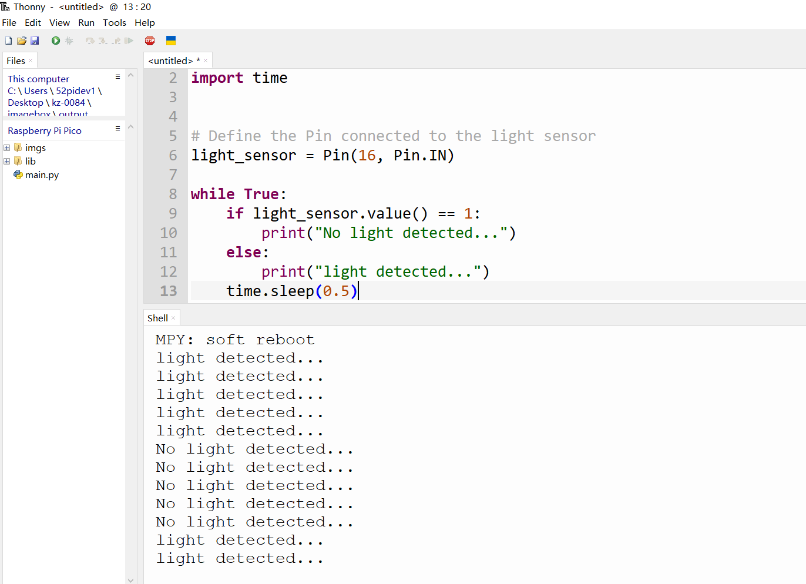

---

## Experiment 7: Control the duration of led by using HW-233 slid pot 

#### Application Scenario

Control the interval time of led by using slid pot HW-233, read analog data from
slid pot and then map the data to 0 to 60 seconds for the LED blink duration.

#### Working Principle

This experiment aims to control the blinking interval of an LED using the HW-233 slide potentiometer. The working principle of the experiment is as follows:

1. **Potentiometer Reading**: The HW-233 slide potentiometer is an analog input device whose output voltage is proportional to the position of the slider. As the slider moves along the potentiometer, it changes the resistance between the two ends, thus altering the output voltage.

2. **Analog Signal Conversion**: In the experiment, a microcontroller (such as an Arduino) will read the analog output of the potentiometer. This analog signal needs to be converted into a digital signal so that the microcontroller can process it. This is typically done through an Analog-to-Digital Converter (ADC).

3. **Data Mapping**: The analog data read will be mapped to a specific time range, i.e., 0.1 to 1 seconds. The mapping process involves converting the value of the analog signal into the corresponding time interval. This can be achieved by writing a specific algorithm or using a lookup table.

4. **LED Control**: Once the analog data is mapped to the time interval, the microcontroller will use this time interval to control the blinking of the LED. Specifically, the microcontroller will set a timer, and when the timer reaches the set time interval, it will toggle the state of the LED (from on to off or from off to on).

5. **Feedback Loop**: This process is cyclical, with the microcontroller continuously reading the value of the potentiometer and updating the LED's blinking interval based on the new value. In this way, users can adjust the blinking speed of the LED in real-time by moving the slider of the potentiometer.

Through this method, the experiment demonstrates how to use a simple analog input device to control the behavior of a digital output device, which is a fundamental concept in electronics and embedded system design.


#### Circuit Wiring

##### Components Required:
1. Raspberry Pi Pico
2. LED Light
3. 220-ohm Resistor
4. Slide Potentiometer (with terminals labeled OTA, OTB, VCC, and GND)

#### Wiring Instructions:

1. **LED Connection:**
   - Connect the longer leg (anode) of the LED to one of the GPIO pins on the Raspberry Pi Pico (e.g., GPIO 15).
   - Connect the shorter leg (cathode) of the LED to one end of the 220-ohm resistor.
   - Connect the other end of the 220-ohm resistor to a GND pin on the Raspberry Pi Pico.

2. **Slide Potentiometer Connection:**
   - Connect the VCC terminal of the slide potentiometer to a 3.3V pin on the Raspberry Pi Pico.
   - Connect the GND terminal of the slide potentiometer to a GND pin on the Raspberry Pi Pico.
   - Connect the OTA terminal of the slide potentiometer to an analog input pin on the Raspberry Pi Pico (e.g., GPIO 26).This pin will be used to read the analog value from the potentiometer.
   - The OTB terminal of the slide potentiometer is typically not used in this setup and can be left unconnected.

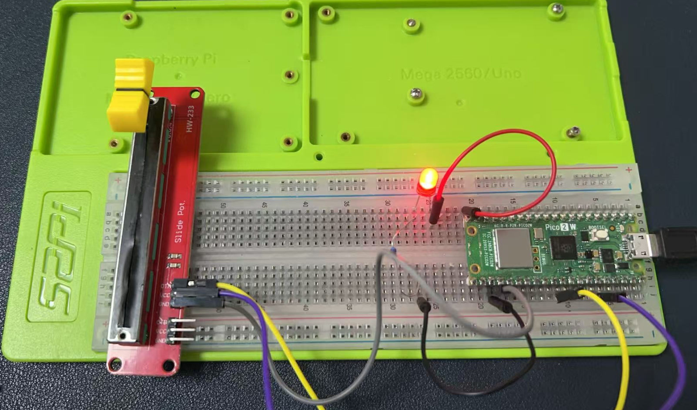

Details:

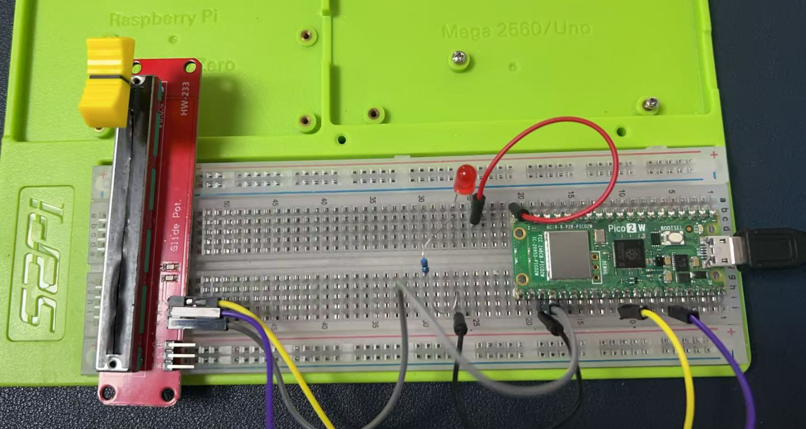

#### Circuit Overview:
- The LED is connected in series with a resistor to limit the current flowing through it, protecting it from burning out.
- The slide potentiometer is used to vary the resistance, which in turn varies the voltage at the OTA terminal. This analog voltage is read by the Raspberry Pi Pico to determine the LED's blinking interval.


#### Final Setup:

- Once all components are connected and the program is uploaded to the Raspberry Pi Pico, you should be able to adjust the blinking interval of the LED by moving the slider on the potentiometer.

This setup allows you to control the LED's blinking duration dynamically using the slide potentiometer, demonstrating a practical application of analog input in a microcontroller-based project.

#### MicroPython Demo Code

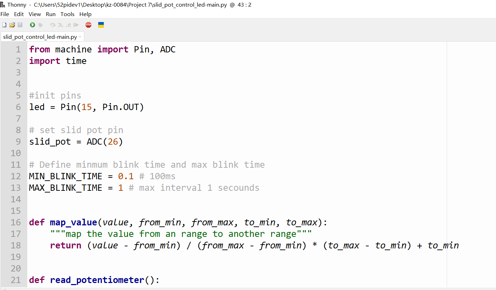

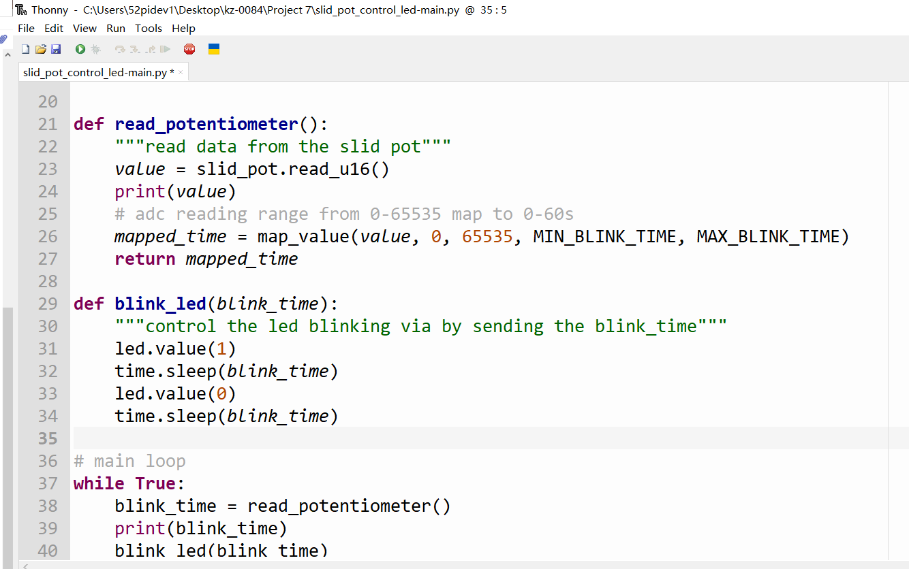

#### Demo code

```python
from machine import Pin, ADC
import time


#init pins
led = Pin(15, Pin.OUT)

# set slid pot pin
slid_pot = ADC(26)

# Define minmum blink time and max blink time
MIN_BLINK_TIME = 0.1 # 100ms
MAX_BLINK_TIME = 1 # max interval 1 secounds


def map_value(value, from_min, from_max, to_min, to_max):
    """map the value from an range to another range"""
    return (value - from_min) / (from_max - from_min) * (to_max - to_min) + to_min


def read_potentiometer():
    """read data from the slid pot"""
    value = slid_pot.read_u16()
    print(value)
    # adc reading range from 0-65535 map to 0-60s
    mapped_time = map_value(value, 0, 65535, MIN_BLINK_TIME, MAX_BLINK_TIME)
    return mapped_time


def blink_led(blink_time):
    """control the led blinking via by sending the blink_time"""
    led.value(1)
    time.sleep(blink_time)
    led.value(0)
    time.sleep(blink_time)


# main loop
while True:
    blink_time = read_potentiometer()
    print(blink_time)
    blink_led(blink_time)
```

#### Code Explanation

- `ADC(26)`: Initializes GPIO pin 26 as an ADC input.
- `adc.read_u16()`: Reads the raw 16-bit ADC value.
- `map_value`: Mapping the reading data of slid pot from range 0-65535 to 0.1 to
1 seconds 
- `print()`: Outputs the temperature to the console.

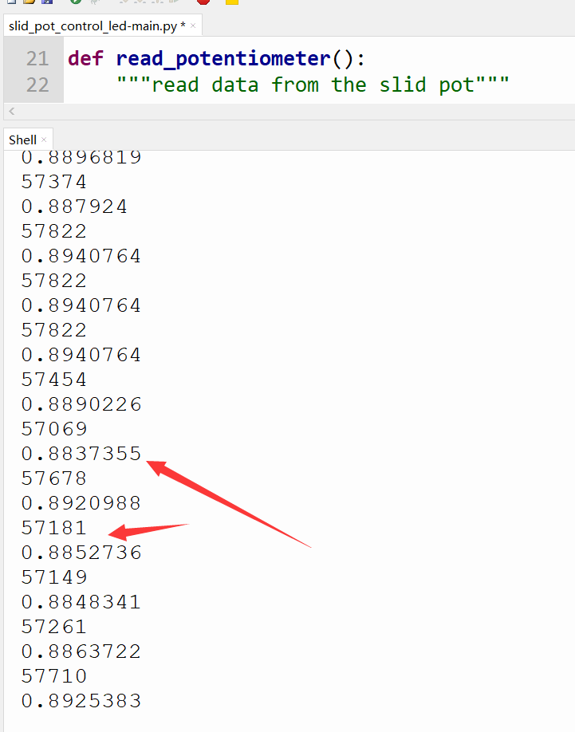

#### Demo video


## Experiment 8: Detecting Sound with a Sound Sensor

#### Application Scenario

Create a noise detector to trigger an alarm when a loud sound is detected.

#### Working Principle

The sound sensor detects sound pressure levels and outputs a digital signal when the sound exceeds a certain threshold.

#### Circuit Wiring

1. Connect the VCC pin of the sound sensor to the 3.3V pin on the Pico 2 WH.
2. Connect the GND pin of the sensor to the GND pin on the Pico 2 WH.
3. Connect the OUT pin of the sensor to GPIO pin 1 on the Pico 2 WH.

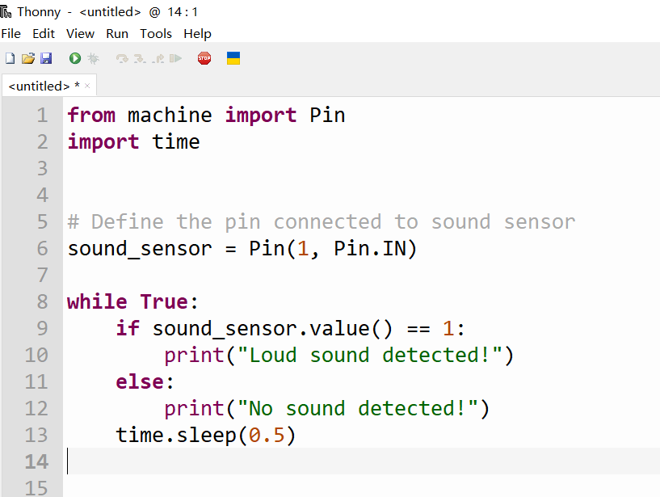

#### MicroPython Demo Code

```python
from machine import Pin
import time

# Define the GPIO pin connected to the sound sensor
sound_sensor = Pin(1, Pin.IN)

while True:
    if sound_sensor.value() == 1:
        print("Loud sound detected!")
    else:
        print("No sound detected.")
    time.sleep(0.5)
```


#### Code Explanation

- `Pin(16, Pin.IN)`: Initializes GPIO pin 16 as an input pin.
- `sound_sensor.value()`: Reads the digital value from the sound sensor (1 for loud sound, 0 for no sound).
- `print()`: Outputs the sound detection status to the console.

---

## Experiment 9: Controlling a Buzzer

#### Application Scenario

Create an alarm system that buzzes when a specific condition is met (e.g., motion detected).

#### Working Principle

The buzzer generates sound by vibrating a diaphragm. It can be controlled by toggling the GPIO pin's voltage.

#### Circuit Wiring

1. Connect the positive pin of the buzzer to GPIO pin VBUS (5V) on the Pico 2 WH.
2. Connect the negative pin of the buzzer to the 17 pin on the Pico 2 WH.

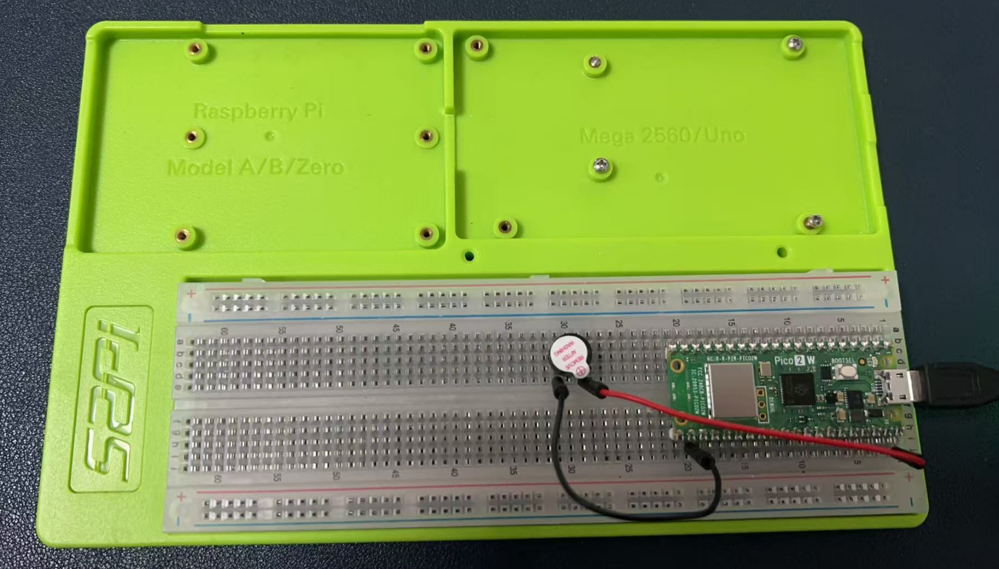

#### MicroPython Demo Code

```python
from machine import Pin
import time

# Define the GPIO pin connected to the buzzer
buzzer = Pin(17, Pin.OUT)

while True:
    buzzer.value(1)  # Turn on the buzzer
    time.sleep(0.5)  # Buzz for 0.5 seconds
    buzzer.value(0)  # Turn off the buzzer
    time.sleep(1)  # Wait for 1 second
```

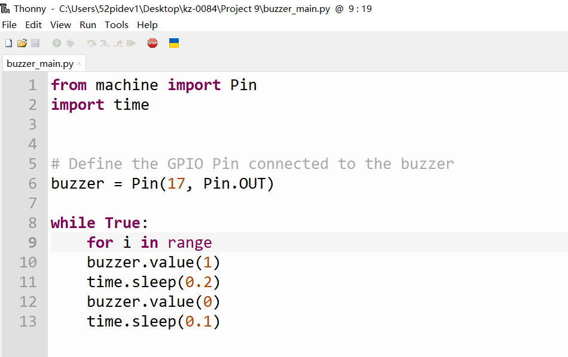

#### Code Explanation

- `Pin(17, Pin.OUT)`: Initializes GPIO pin 17 as an output pin.
- `buzzer.value(1)`: Sets the pin to HIGH, turning on the buzzer.
- `time.sleep(0.5)`: Pauses the program for 0.5 seconds.
- `buzzer.value(0)`: Sets the pin to LOW, turning off the buzzer.


---

## Experiment 10: Using a Rotary Encoder

#### Application Scenario

Create a volume control or menu navigation system using the rotary encoder.

#### Working Principle

The rotary encoder converts mechanical rotation into digital pulses. It outputs two signals (A and B) that can be used to determine rotation direction and speed.

#### Circuit Wiring

1. Connect the VCC(+) pin of the rotary encoder to the 5V(VBUS) pin on the Pico 2 WH.
2. Connect the GND pin of the encoder to the GND pin on the Pico 2 WH.
3. Connect the CLK pin to GPIO pin 14.
4. Connect the DT pin to GPIO pin 13.
5. Connect the SW pin to GPIO pin 12. 

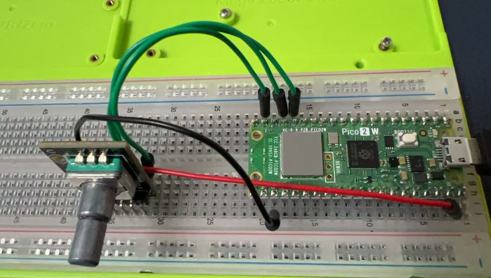

#### MicroPython Demo Code

```python
from machine import Pin
import time

# init pins
clk = Pin(14, Pin.IN, Pin.PULL_UP)  # CLK pin
dt = Pin(13, Pin.IN, Pin.PULL_UP)   # DT pin
sw = Pin(12, Pin.IN, Pin.PULL_UP)   # button pin

# init variables
encoder_pos = 0
last_clk_state = clk.value()

# handle encoder
def handle_encoder(pin):
    global encoder_pos, last_clk_state
    current_clk_state = clk.value()
    if current_clk_state != last_clk_state:
        if dt.value() != current_clk_state:
            encoder_pos += 1
        else:
            encoder_pos -= 1
        last_clk_state = current_clk_state

# register interrupt
clk.irq(trigger=Pin.IRQ_RISING | Pin.IRQ_FALLING, handler=handle_encoder)

# main loop.
while True:
    print("Encoder Position:", encoder_pos)
    time.sleep(0.1)
```

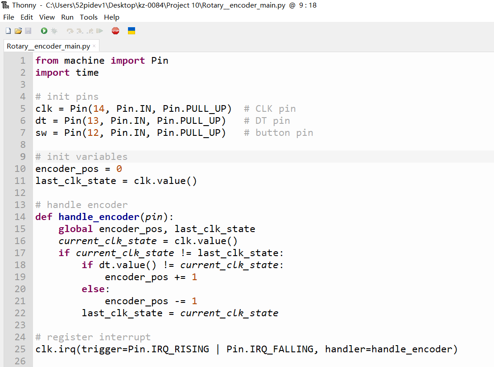

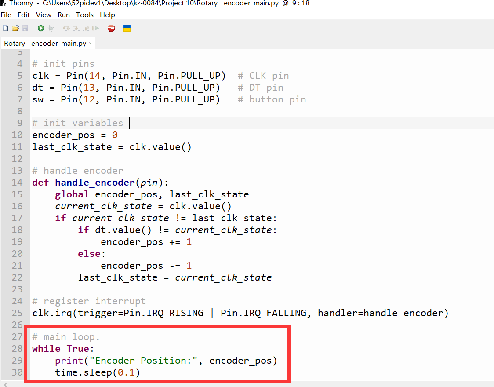

#### Code Explanation

```python
from machine import Pin
import time
```
- **`from machine import Pin`**: Import the `Pin` class from the `machine` module. This allows us to interact with the GPIO pins on the Raspberry Pi Pico.
- **`import time`**: Import the `time` module, which provides functions for working with time-related operations, such as delays.

```python
# init pins
clk = Pin(14, Pin.IN, Pin.PULL_UP)  # CLK pin
dt = Pin(13, Pin.IN, Pin.PULL_UP)   # DT pin
sw = Pin(12, Pin.IN, Pin.PULL_UP)   # button pin
```
- **`clk = Pin(14, Pin.IN, Pin.PULL_UP)`**: Initialize the CLK pin connected to GPIO 14 as an input pin with an internal pull-up resistor. This pin will be used to detect the clock signal from the rotary encoder.
- **`dt = Pin(13, Pin.IN, Pin.PULL_UP)`**: Initialize the DT pin connected to GPIO 13 as an input pin with an internal pull-up resistor. This pin will be used to detect the direction signal from the rotary encoder.
- **`sw = Pin(12, Pin.IN, Pin.PULL_UP)`**: Initialize the button pin connected to GPIO 12 as an input pin with an internal pull-up resistor. This pin is used to detect button presses (if the rotary encoder has a built-in button).

```python
# init variables 
encoder_pos = 0
last_clk_state = clk.value()
```
- **`encoder_pos = 0`**: Initialize the `encoder_pos` variable to store the current position of the rotary encoder. It starts at 0.
- **`last_clk_state = clk.value()`**: Read the initial state of the CLK pin and store it in `last_clk_state`. This will be used to detect changes in the CLK signal.

```python
# handle encoder 
def handle_encoder(pin):
    global encoder_pos, last_clk_state
    current_clk_state = clk.value()
    if current_clk_state != last_clk_state:
        if dt.value() != current_clk_state:
            encoder_pos += 1
        else:
            encoder_pos -= 1
        last_clk_state = current_clk_state
```
- **`def handle_encoder(pin)`**: Define a function called `handle_encoder` that will be called whenever an interrupt occurs on the CLK pin.
- **`global encoder_pos, last_clk_state`**: Declare that we are using the global variables `encoder_pos` and `last_clk_state` inside this function.
- **`current_clk_state = clk.value()`**: Read the current state of the CLK pin.
- **`if current_clk_state != last_clk_state`**: Check if the state of the CLK pin has changed since the last time it was read.
- **`if dt.value() != current_clk_state`**: Compare the state of the DT pin with the current state of the CLK pin.
  - If they are different, it means the encoder is rotating in one direction, so increment `encoder_pos` by 1.
  - If they are the same, it means the encoder is rotating in the opposite direction, so decrement `encoder_pos` by 1.
- **`last_clk_state = current_clk_state`**: Update `last_clk_state` to the current state of the CLK pin to prepare for the next change detection.

```python
# register interrupt 
clk.irq(trigger=Pin.IRQ_RISING | Pin.IRQ_FALLING, handler=handle_encoder)
```
- **`clk.irq(trigger=Pin.IRQ_RISING | Pin.IRQ_FALLING, handler=handle_encoder)`**: Register an interrupt on the CLK pin. This means that whenever the CLK pin changes state (either rising or falling edge), the `handle_encoder` function will be called.

```python
# main loop.
while True:
    print("Encoder Position:", encoder_pos)
    time.sleep(0.1)
```
- **`while True`**: Start an infinite loop that will run continuously.
- **`print("Encoder Position:", encoder_pos)`**: Print the current position of the rotary encoder to the console.
- **`time.sleep(0.1)`**: Pause for 0.1 seconds before printing the encoder position again. This creates a small delay to avoid flooding the console with too many updates.

### Summary
This code sets up a rotary encoder connected to the Raspberry Pi Pico. It uses GPIO pins to read the encoder's clock (CLK) and direction (DT) signals. The `handle_encoder` function is called whenever the CLK signal changes, and it updates the `encoder_pos` variable based on the direction of rotation. The main loop continuously prints the current position of the encoder to the console.


Result: 

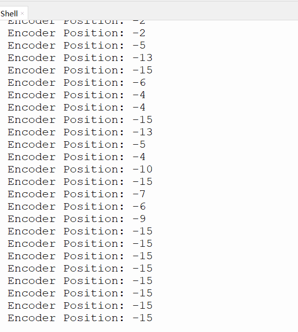

---- 

## Experiment 11: 1.3inch IPS_LCD display 


#### Application Scenario

The project aims to remotely send images from a computer to a Raspberry Pi Pico 2W microcontroller, which is connected to a network and equipped with a 1.3-inch IPS LCD screen. The goal is to display these images on the small screen using a Python script.

#### Components Involved
- **Raspberry Pi Pico 2W**: A microcontroller board with Wi-Fi capabilities.
- **1.3-inch IPS LCD Screen**: A small display screen connected to the Pico 2W.
- **Python Script**: A program running on a computer that sends images over the network.
- **MicroPython Firmware**: The software running on the Raspberry Pi Pico 2W to handle network communication and display images.

#### Work Principle

#### **3.1 Image Preparation**
- Images are stored in a directory on a computer.
- These images are encoded in a format suitable for transmission over a network (e.g., JPEG, PNG).

#### **3.2 Network Communication**
1. **Computer Side**:
   - The Python script running on the computer establishes a network connection to the Raspberry Pi Pico 2W.
   - The script reads the images from the directory and converts them into a binary format suitable for transmission.
   - The script sends the image data over the network to the Pico 2W.

2. **Raspberry Pi Pico 2W Side**:
   - The Pico 2W is connected to the same network as the computer.
   - It runs a MicroPython script that listens for incoming connections.
   - When it receives image data, it decodes the binary data and prepares it for display on the LCD screen.

#### **3.3 Display on the LCD Screen**
- The Pico 2W uses its GPIO pins to interface with the 1.3-inch IPS LCD screen.
- The MicroPython script on the Pico 2W converts the received image data into a format that the LCD screen can display.
- The image is then rendered on the LCD screen.

### **4. Challenges and Limitations**
- **MicroPython Firmware Version**: The official MicroPython firmware may have limitations in handling network communication or large image data.
- **CYW43 Wi-Fi Driver**: The official CYW43 Wi-Fi driver for the Raspberry Pi Pico may have bugs or compatibility issues, especially with certain Wi-Fi networks.
- **2.4GHz Network Support**: The Wi-Fi module on the Pico 2W only supports 2.4GHz networks, which may be less reliable or have connectivity issues compared to 5GHz networks.
- **Retry Mechanism**: Due to these limitations, the project may require multiple attempts to successfully send and display images.

### **5. Detailed Steps**

#### **5.1 Computer Script**
1. **Establish Network Connection**:
   - The script connects to the Pico 2W using a TCP/IP connection.
   - It may use a predefined IP address or discover the Pico 2W on the network.

2. **Read and Encode Images**:
   - The script reads images from a specified directory.
   - Each image is encoded into a binary format (e.g., using libraries like `Pillow` in Python).

3. **Send Image Data**:
   - The binary data is sent over the network to the Pico 2W.
   - The script may include headers or metadata to indicate the size and format of the image data.

#### **5.2 Pico 2W Script**
1. **Listen for Connections**:
   - The Pico 2W runs a MicroPython script that sets up a TCP/IP server.
   - It listens for incoming connections from the computer.

2. **Receive and Decode Image Data**:
   - When data is received, the Pico 2W decodes the binary data.
   - It may use libraries like `ustruct` to handle the binary data.

3. **Render Image on LCD**:
   - The decoded image data is converted into a format suitable for the LCD screen.
   - The Pico 2W uses its GPIO pins to control the LCD screen and display the image.

### **6. Conclusion**
This project demonstrates the possibility of sending images over a network to a microcontroller and displaying them on a small LCD screen. Despite potential challenges due to firmware and hardware limitations, it provides a practical example of remote image transmission and display using Wi-Fi and MicroPython.

#### Circuit Wiring

| Raspberry Pi Pico 2WH | 1.3Inch IPS_LCD 240x240 RGB display module | 
| ----------- | ----------- |
|  GP2        | SCL(SCK)  |
|  GP3        | SDA(MOSI) |
|  GP4        | DC        |
|  GP5        | CS        |
|  GP6        | RST       |
|  GP7        | BLK       |

#### MicroPython Demo Code
* LCD.py driver
Just click `Stop` button on the thonny IDE and create a new file, and then copy and paste follow code into it, save it to
Raspberry Pi Pico 2W's `/lib` folder, name it `LCD.py` will be ok. 

```python
from machine import Pin, SPI
import time

class ST7789:
    def __init__(self):
        self.LCD_SCK = Pin(2)
        self.LCD_MOSI = Pin(3)
        self.LCD_DC = Pin(4, Pin.OUT)
        self.LCD_CS = Pin(5, Pin.OUT, value=1)
        self.LCD_RST = Pin(6, Pin.OUT, value=1)
        self.LCD_BL = Pin(7, Pin.OUT, value=0)
        
        self.spi = SPI(0, baudrate=1_000_000, polarity=0, phase=0, sck=self.LCD_SCK, mosi=self.LCD_MOSI)
        
        self.init_lcd()
        
    def cs_select(self):
        self.LCD_CS(0)
    
    def cs_deselect(self):
        self.LCD_CS(1)
    
    def write_cmd(self, cmd):
        self.LCD_DC(0)
        self.cs_select()
        self.spi.write(bytes([cmd]))
        self.cs_deselect()
    
    def write_data(self, data):
        self.LCD_DC(1)
        self.cs_select()
        self.spi.write(bytes([data]))
        self.cs_deselect()
    
    def address_set(self, x1, y1, x2, y2):
        self.write_cmd(0x2A)
        self.write_data(x1 >> 8)
        self.write_data(x1 & 0xFF)
        self.write_data(x2 >> 8)
        self.write_data(x2 & 0xFF)
        
        self.write_cmd(0x2B)
        self.write_data(y1 >> 8)
        self.write_data(y1 & 0xFF)
        self.write_data(y2 >> 8)
        self.write_data(y2 & 0xFF)
        
        self.write_cmd(0x2C)
    
    def init_lcd(self):
        self.LCD_RST(1)
        time.sleep_ms(100)
        self.LCD_RST(0)
        time.sleep_ms(100)
        self.LCD_RST(1)
        
        # Memory Data Access Control
        self.write_cmd(0x36);
        self.write_data(0x00);
        # RGB 5-6-5-bit 
        self.write_cmd(0x3A);
        self.write_data(0x65);
        # Porch Setting
        self.write_cmd(0xB2);
        self.write_data(0x0C);
        self.write_data(0x0C);
        self.write_data(0x00);
        self.write_data(0x33);
        self.write_data(0x33);
        #  Gate Control
        self.write_cmd(0xB7);
        self.write_data(0x35);
        # VCOM Setting
        self.write_cmd(0xBB);
        self.write_data(0x19);
        # LCM Control
        self.write_cmd(0xC0);
        self.write_data(0x2C);
        # VDV and VRH Command Enable
        self.write_cmd(0xC2);
        self.write_data(0x01);
        # VRH Set
        self.write_cmd(0xC3);
        self.write_data(0x12);
        # VDV Set
        self.write_cmd(0xC4);
        self.write_data(0x20);
        # Frame Rate Control in Normal Mode
        self.write_cmd(0xC6);
        self.write_data(0x0F);
        # Power Control 1
        self.write_cmd(0xD0);
        self.write_data(0xA4);
        self.write_data(0xA1);
        # Positive Voltage Gamma Control
        self.write_cmd(0xE0);
        self.write_data(0xD0);
        self.write_data(0x04);
        self.write_data(0x0D);
        self.write_data(0x11);
        self.write_data(0x13);
        self.write_data(0x2B);
        self.write_data(0x3F);
        self.write_data(0x54);
        self.write_data(0x4C);
        self.write_data(0x18);
        self.write_data(0x0D);
        self.write_data(0x0B);
        self.write_data(0x1F);
        self.write_data(0x23);
        # Negative Voltage Gamma Control
        self.write_cmd(0xE1);
        self.write_data(0xD0);
        self.write_data(0x04);
        self.write_data(0x0C);
        self.write_data(0x11);
        self.write_data(0x13);
        self.write_data(0x2C);
        self.write_data(0x3F);
        self.write_data(0x44);
        self.write_data(0x51);
        self.write_data(0x2F);
        self.write_data(0x1F);
        self.write_data(0x1F);
        self.write_data(0x20);
        self.write_data(0x23);
        # Display Inversion On
        self.write_cmd(0x21);
        # Sleep Out
        self.write_cmd(0x11);
        time.sleep(0.1)
        self.write_cmd(0x29);
        
        self.LCD_BL(1)  # 开启背光
    
    def fill(self, x, y, length, width, data):
        self.address_set(x, y, x + length - 1, y + width - 1)
        self.LCD_DC(1)
        self.cs_select()
        self.spi.write(data)
        self.cs_deselect()

```

#### Code Explanation

This `ST7789` class is a driver for an ST7789 LCD display, typically used with microcontrollers like the Raspberry Pi Pico. It provides a set of methods to initialize the display, set the display area, and write pixel data to the screen. Below is a detailed explanation of the key components and methods in this driver:

### **1. Initialization (`__init__` method)**
```python
def __init__(self):
    self.LCD_SCK = Pin(2)
    self.LCD_MOSI = Pin(3)
    self.LCD_DC = Pin(4, Pin.OUT)
    self.LCD_CS = Pin(5, Pin.OUT, value=1)
    self.LCD_RST = Pin(6, Pin.OUT, value=1)
    self.LCD_BL = Pin(7, Pin.OUT, value=0)

    self.spi = SPI(0, baudrate=1_000_000, polarity=0, phase=0, sck=self.LCD_SCK, mosi=self.LCD_MOSI)

    self.init_lcd()
```
- **Pin Initialization**:
  - `LCD_SCK` (Serial Clock): Used for clocking data into the display.
  - `LCD_MOSI` (Master Out Slave In): Used for sending data to the display.
  - `LCD_DC` (Data/Command Control): Used to indicate whether the data being sent is a command or pixel data.
  - `LCD_CS` (Chip Select): Used to enable communication with the display.
  - `LCD_RST` (Reset): Used to reset the display.
  - `LCD_BL` (Backlight Control): Used to control the backlight of the display.
- **SPI Initialization**:
  - An SPI object is created with a baudrate of 1 MHz, which is the speed at which data is sent to the display.
  - The `polarity` and `phase` parameters are set to 0, which means the clock line is low when idle and transitions from low to high to clock in data.
- **Display Initialization**:
  - The `init_lcd` method is called to set up the display with the correct configuration.

### **2. Chip Select Methods**
```python
def cs_select(self):
    self.LCD_CS(0)

def cs_deselect(self):
    self.LCD_CS(1)
```
- These methods control the `LCD_CS` pin to enable or disable communication with the display. `cs_select` sets `LCD_CS` to 0 (active), and `cs_deselect` sets it to 1 (inactive).

### **3. Command and Data Writing**
```python
def write_cmd(self, cmd):
    self.LCD_DC(0)
    self.cs_select()
    self.spi.write(bytes([cmd]))
    self.cs_deselect()

def write_data(self, data):
    self.LCD_DC(1)
    self.cs_select()
    self.spi.write(bytes([data]))
    self.cs_deselect()
```
- **`write_cmd`**:
  - Sets `LCD_DC` to 0 to indicate a command.
  - Selects the display using `cs_select`.
  - Sends the command byte via SPI.
  - Deselects the display using `cs_deselect`.
- **`write_data`**:
  - Sets `LCD_DC` to 1 to indicate data.
  - Selects the display.
  - Sends the data byte via SPI.
  - Deselects the display.

### **4. Address Setting**
```python
def address_set(self, x1, y1, x2, y2):
    self.write_cmd(0x2A)
    self.write_data(x1 >> 8)
    self.write_data(x1 & 0xFF)
    self.write_data(x2 >> 8)
    self.write_data(x2 & 0xFF)

    self.write_cmd(0x2B)
    self.write_data(y1 >> 8)
    self.write_data(y1 & 0xFF)
    self.write_data(y2 >> 8)
    self.write_data(y2 & 0xFF)

    self.write_cmd(0x2C)
```
- This method sets the display area for writing pixel data.
  - `0x2A` and `0x2B` are commands to set the column and row addresses, respectively.
  - `x1`, `y1` are the starting coordinates, and `x2`, `y2` are the ending coordinates.
  - The coordinates are split into high and low bytes and sent separately.

### **5. Display Initialization**
```python
def init_lcd(self):
    self.LCD_RST(1)
    time.sleep_ms(100)
    self.LCD_RST(0)
    time.sleep_ms(100)
    self.LCD_RST(1)

    # ... (many initialization commands)

    self.LCD_BL(1)  # Turn on the backlight
```
- This method initializes the display by sending a series of commands and data to configure it.
  - The display is reset by toggling the `LCD_RST` pin.
  - Various commands are sent to set parameters such as memory access control, pixel format, porch settings, gamma control, etc.
  - Finally, the backlight is turned on by setting `LCD_BL` to 1.

### **6. Filling the Display**
```python
def fill(self, x, y, length, width, data):
    self.address_set(x, y, x + length - 1, y + width - 1)
    self.LCD_DC(1)
    self.cs_select()
    self.spi.write(data)
    self.cs_deselect()
```
- This method writes pixel data to a specified area of the display.
  - It first sets the display area using `address_set`.
  - It then sets `LCD_DC` to 1 to indicate data.
  - The pixel data is sent via SPI.

### **Summary**
This `ST7789` class provides a comprehensive interface for controlling an ST7789 LCD display. It handles initialization, command and data writing, address setting, and pixel data transmission. By using this driver, you can easily display images or graphics on the LCD screen connected to a microcontroller.

### App demo code 

* main.py demo code for Raspberry Pico 2W 

```python
from LCD import ST7789
import network
import socket
import struct
import machine
import time

ssid = "REPLACE_HERE_WITH_YOUR_2.4GHZ_NETWORK_SSID"
password = "REPLACE_HERE_WITH_YOUR_2.4GHZ_NETWORK_PASSWORD"


wlan = network.WLAN(network.STA_IF)
wlan.active(True)
wlan.connect(ssid, password)

while not wlan.isconnected():
    pass

print("Connected, IP address:", wlan.ifconfig()[0])

lcd = ST7789()

if wlan.isconnected():
    PORT = 49152 
    ACK_PAYLOAD = b'OK'
    sock = socket.socket(socket.AF_INET, socket.SOCK_STREAM)
    sock.bind(('0.0.0.0', PORT))
    sock.listen(1)
    sock.setsockopt(socket.SOL_SOCKET, socket.SO_REUSEADDR, 1)

    print(f"Listening on port {PORT}...")

def handle_client(client_sock):
    try:
        while True:
            header = client_sock.recv(8)
            if len(header) < 8:
                print("Client disconnected or header too short")
                break 

            x, y, length, width = struct.unpack("!HHHH", header)  
            expected_data_len = length * width * 2  

            print(f"Received: x={x}, y={y}, length={length}, width={width}")

            pixel_data = bytearray()
            while len(pixel_data) < expected_data_len:
                chunk = client_sock.recv(expected_data_len - len(pixel_data))
                if not chunk:  
                    print("Client disconnected during data reception")
                    return
                pixel_data.extend(chunk)

            if len(pixel_data) == expected_data_len:
                lcd.fill(x, y, length, width, pixel_data)  
                print("LCD updated")

            client_sock.send(ACK_PAYLOAD)  
    except Exception as e:
        print("Error:", e)
    finally:
        client_sock.close()
        print("Connection closed")

while True:
    print("Connected, IP address:", wlan.ifconfig()[0])
    client, addr = sock.accept()
    print(f"Connection from {addr}")
    handle_client(client)  

```
#### Code explanations

This code is a Python script designed to run on a microcontroller (such as the Raspberry Pi Pico) with a network interface and an ST7789 LCD display. It connects to a Wi-Fi network and sets up a TCP server to receive image data from a client, which it then displays on the LCD screen. Below is a detailed explanation of the code in English:

### **1. Wi-Fi Connection**

```python
ssid = "mywifi"
password = "passwordofwifi"

wlan = network.WLAN(network.STA_IF)
wlan.active(True)
wlan.connect(ssid, password)

while not wlan.isconnected():
    pass

print("Connected, IP address:", wlan.ifconfig()[0])
```

- **Purpose**: Connects the device to a Wi-Fi network.
- **Details**:
  - `ssid` and `password` store the Wi-Fi network's name and password.
  - `network.WLAN(network.STA_IF)` initializes the Wi-Fi interface in station mode (to connect to an access point).
  - `wlan.active(True)` activates the Wi-Fi interface.
  - `wlan.connect(ssid, password)` attempts to connect to the specified Wi-Fi network.
  - The `while` loop waits until the connection is established.
  - Once connected, it prints the IP address assigned to the device.

### **2. LCD Initialization**

```python
lcd = ST7789()
```

- **Purpose**: Initializes the ST7789 LCD display.
- **Details**:
  - `ST7789` is a class (likely defined in the `LCD` module) that handles communication with the ST7789 display.
  - This line creates an instance of the `ST7789` class, initializing the display and preparing it for use.

### **3. TCP Server Setup**

```python
if wlan.isconnected():
    PORT = 49152  # listen port  
    ACK_PAYLOAD = b'OK'
    sock = socket.socket(socket.AF_INET, socket.SOCK_STREAM)
    sock.bind(('0.0.0.0', PORT))
    sock.listen(1)
    sock.setsockopt(socket.SOL_SOCKET, socket.SO_REUSEADDR, 1)

    print(f"Listening on port {PORT}...")
```

- **Purpose**: Sets up a TCP server to listen for incoming connections.
- **Details**:
  - The server listens on port `49152`.
  - `ACK_PAYLOAD` is a byte string (`b'OK'`) that will be sent to clients as an acknowledgment.
  - `socket.socket(socket.AF_INET, socket.SOCK_STREAM)` creates a TCP socket.
  - `sock.bind(('0.0.0.0', PORT))` binds the socket to all available network interfaces on the specified port.
  - `sock.listen(1)` allows the server to accept one incoming connection at a time.
  - `sock.setsockopt(socket.SOL_SOCKET, socket.SO_REUSEADDR, 1)` allows the socket to reuse the address, which can be useful for quick restarts of the server.

### **4. Handling Client Connections**

```python
def handle_client(client_sock):
    try:
        while True:
            header = client_sock.recv(8)
            if len(header) < 8:
                print("Client disconnected or header too short")
                break
            
            x, y, length, width = struct.unpack("!HHHH", header)
            expected_data_len = length * width * 2  # RGB565 format, 2 bytes per pixel

            print(f"Received: x={x}, y={y}, length={length}, width={width}")

            pixel_data = bytearray()
            while len(pixel_data) < expected_data_len:
                chunk = client_sock.recv(expected_data_len - len(pixel_data))
                if not chunk:
                    print("Client disconnected during data reception")
                    return
                pixel_data.extend(chunk)

            if len(pixel_data) == expected_data_len:
                lcd.fill(x, y, length, width, pixel_data)
                print("LCD updated")

            client_sock.send(ACK_PAYLOAD)
    except Exception as e:
        print("Error:", e)
    finally:
        client_sock.close()
        print("Connection closed")
```
- **Purpose**: Handles incoming client connections and processes the received image data.
- **Details**:
  - The function `handle_client` takes a client socket (`client_sock`) as an argument.
  - It first receives an 8-byte header from the client, which contains the image's coordinates (`x`, `y`), length, and width.
  - `struct.unpack("!HHHH", header)` unpacks the header into four unsigned short integers (`x`, `y`, `length`, `width`).
  - It calculates the expected length of the pixel data based on the image dimensions and format (RGB565, 2 bytes per pixel).
  - It then receives the pixel data in chunks until the full expected length is received.
  - If the received data length matches the expected length, it calls `lcd.fill` to display the image on the LCD.
  - After processing the data, it sends an acknowledgment (`ACK_PAYLOAD`) back to the client.
  - If any error occurs during this process, it prints the error message and closes the client socket.

### **5. Main Loop**

```python
while True:
    print("Connected, IP address:", wlan.ifconfig()[0])
    client, addr = sock.accept()
    print(f"Connection from {addr}")
    handle_client(client)
```
- **Purpose**: Continuously listens for incoming client connections and processes them.
- **Details**:
  - The `while True` loop keeps the server running indefinitely.
  - `sock.accept()` waits for an incoming connection and returns a client socket and the client's address.
  - `handle_client(client)` processes the client connection by handling the received data and updating the LCD display.

### **Summary**

This script sets up a TCP server on a Wi-Fi-connected device with an ST7789 LCD display. It listens for incoming connections, receives image data from clients, and displays the images on the LCD screen. The script handles network communication, data reception, and display updating, providing a basic framework for remote image display over a network.

#### Image Server 
* This is a server that you can build on your own PC or raspberry Pi. 
you can create your own virtual environment by following steps. 

Installing Python and setting up a virtual environment on Windows involves a few straightforward steps. Below is a detailed guide to help you through the process:

### **1. Install Python**

#### **Step 1: Download Python**
1. Go to the [official Python website](https://www.python.org/downloads/).
2. Click on the "Download Python" button, which will download the latest version of Python for Windows.
3. Alternatively, you can choose a specific version from the "Downloads" section if you need an older version.

#### **Step 2: Run the Installer**
1. Locate the downloaded installer file (usually named `python-x.x.x.exe`).
2. Double-click the installer to run it.
3. In the installer window, make sure to check the box that says **"Add Python to PATH"**. This will allow you to run Python from the command line.
4. Click on **"Install Now"** to start the installation process.
5. Wait for the installation to complete. Once done, you can close the installer.

#### **Step 3: Verify Installation**
1. Open a new Command Prompt window.
2. Type the following command and press Enter:
   ```bash
   python --version
   ```
   This should display the version of Python that you just installed, confirming that Python is correctly installed and added to your system's PATH.

### **2. Install `virtualenv`**

#### **Step 1: Install `virtualenv` Using pip**
1. Open a Command Prompt window.
2. Install `virtualenv` using the Python package manager `pip` by running the following command:
   ```bash
   pip install virtualenv
   ```
   This command downloads and installs the `virtualenv` package.

#### **Step 2: Verify Installation**
1. After the installation completes, you can verify that `virtualenv` is installed by running:
   ```bash
   virtualenv --version
   ```
   This should display the version of `virtualenv` that you just installed.

### **3. Create a Virtual Environment**

#### **Step 1: Create a Project Directory**
1. Create a directory for your project. For example, you can create a directory named `my_project`:
   ```bash
   mkdir my_project
   cd my_project
   ```

#### **Step 2: Create a Virtual Environment**
1. Inside your project directory, create a virtual environment by running:
   ```bash
   virtualenv venv
   ```
   This command creates a new directory named `venv` (you can name it anything you like) that contains the virtual environment.

#### **Step 3: Activate the Virtual Environment**
1. To activate the virtual environment, run the following command:
   ```bash
   .\venv\Scripts\activate
   ```
   Once activated, your command prompt will show the name of the virtual environment in the prompt (e.g., `(venv)`).

#### **Step 4: Deactivate the Virtual Environment**
1. When you are done working in the virtual environment, you can deactivate it by simply running:
   ```bash
   deactivate
   ```

### **Summary**
1. **Install Python**: Download from the official website and run the installer, ensuring Python is added to your PATH.
2. **Install `virtualenv`**: Use `pip install virtualenv` to install the `virtualenv` package.
3. **Create and Activate a Virtual Environment**: Use `virtualenv venv` to create a virtual environment and `.\venv\Scripts\activate` to activate it.

By following these steps, you will have Python installed on your Windows system and be able to create and manage virtual environments for your projects.

To install the Python Imaging Library (PIL), you should actually install its more actively maintained fork called `Pillow`. Here’s how you can install Python, `virtualenv`, and `Pillow` on Windows:

### **Install Pillow**
Once the virtual environment is activated, install Pillow using `pip`:
```bash
pip install pillow
```

### **Verify Installation**
To verify that Pillow is installed correctly, you can run a simple Python script to check if it imports successfully:

```python
from PIL import Image
print("Pillow is installed and working!")
```

Save this script as `test_pillow.py` and run it:

```bash
python test_pillow.py
```

If Pillow is installed correctly, you should see the message: `Pillow is installed and working!`.

### Image server demo code  
Get into the virtual environment, and activate it, create a python file and copy
& paste following code into it and then save it as `image_server.py`. 
Below is the server-side code for sending images:

```python
import socket
import struct
from PIL import Image
import os
import time 

# Configure server information
# replace this ip address with your pico 2w' obtianed IP address.

SERVER_IP = '192.168.3.46'
SERVER_PORT = 49152  # Replace with the actual port

def rgb888_to_rgb565(r, g, b):
    """Convert RGB888 format to RGB565 format"""
    return ((r & 0xF8) << 8) | ((g & 0xFC) << 3) | (b >> 3)

def send_image_to_server(image_path):
    # Open and resize the image
    img = Image.open(image_path).resize((240, 240), Image.Resampling.LANCZOS)
    img = img.convert('RGB')

    # Create a TCP socket and connect
    sock = socket.socket(socket.AF_INET, socket.SOCK_STREAM)
    sock.connect((SERVER_IP, SERVER_PORT))

    # Loop through each row
    for y in range(240):
        # Construct the header (X=0, Y=y, Length=240, Width=1)
        header = struct.pack('!HHHH', 0, y, 240, 1)
        
        # Construct pixel data
        pixel_data = b''
        for x in range(240):
            r, g, b = img.getpixel((x, y))
            pixel_data += struct.pack('!H', rgb888_to_rgb565(r, g, b))
        
        # Combine the packet
        packet = header + pixel_data
        
        # Send the data
        sock.send(packet)
        print(f"Sent row {y}")

        # Wait for the client to return 'OK'
        while True:
            response = sock.recv(2).decode('utf-8')  # Receive a 2-byte response
            if response == 'OK':
                print(f"Received 'OK' for row {y}")
                break
            else:
                print(f"Unexpected response: {response}, waiting for 'OK'")
                
    # Close the connection
    sock.close()

while True:
    print("Start transmitting...")
    image_file = os.listdir(r"D:/kz-0084/PICO2W_TCP/")
    print(image_file)
    for picture in image_file:
        if picture.endswith((".png", ".jpg", ".gif")):
            full_path = os.path.join(os.getcwd(), picture)
            print(full_path)
            send_image_to_server(full_path)
            time.sleep(20)
```

### Sending image to Pico 2w 

* Step 1. Connect your Pico 2w to your PC and open `thonny` IDE and make sure
the `main.py` is running. 

* Step 2. Execute the `image_server.py` to send image to Pico 2W 

```bash
python image_server.py
```

### **Explanation of the Code**

1. **Configuration**:
   - The server's IP address (`SERVER_IP`) and port (`SERVER_PORT`) are defined. These should match the IP address and port of the TCP server running on the Raspberry Pi Pico 2W.

2. **RGB Conversion Function**:
   - `rgb888_to_rgb565(r, g, b)`: Converts RGB888 (24-bit) color format to RGB565 (16-bit) format. This is necessary because the ST7789 display expects 16-bit color data.

3. **Image Sending Function**:
   - `send_image_to_server(image_path)`:
     - Opens an image file and resizes it to 240x240 pixels.
     - Converts the image to RGB format.
     - Establishes a TCP connection to the server.
     - Sends the image data row by row:
       - Constructs a header with the row's coordinates and dimensions.
       - Converts each pixel to RGB565 format and appends it to the pixel data.
       - Combines the header and pixel data into a packet and sends it to the server.
       - Waits for an acknowledgment (`'OK'`) from the server before sending the next row.
     - Closes the connection after all rows are sent.

4. **Main Loop**:
   - Continuously scans a directory (`D:/kz-0084/PICO2W_TCP/`) for image files.
   - Sends each image file to the server using the `send_image_to_server` function.
   - Waits for 6 seconds between sending each image.

### **Key Points**
- **Directory Scanning**: The script scans a specified directory for image files (`.png`, `.jpg`, `.gif`).
- **Image Processing**: Each image is resized to fit the display dimensions (240x240) and converted to RGB format.
- **Network Communication**: The script establishes a TCP connection to the server, sends image data row by row, and waits for an acknowledgment after each row.
- **Error Handling**: The script waits for the expected `'OK'` response from the server. If an unexpected response is received, it continues waiting until the correct response is received.

This script effectively sends images to a remote display over a network, ensuring that each row of pixel data is correctly acknowledged by the server.


## Experiment 12: 1.3inch IPS_LCD display imagebox 

### Application Scenario

Build an imagebox by using the same circuit as `Experiment 11`. 

### Working Principle

Using the Pico 2W and a 1.3-inch IPS-LCD together to create a picture box that loops through images can be quite fun. By using Python code on a computer to convert favorite images into binary bin files, uploading them to the imgs directory of the Pico 2W via Thonny, and then displaying each image using MicroPython, the process can be very enjoyable. Below is the complete method of operation.

### Circuit Wiring 

| Raspberry Pi Pico 2WH | 1.3Inch IPS_LCD 240x240 RGB display module | 
| ----------- | ----------- |
|  GP2        | SCL(SCK)  |
|  GP3        | SDA(MOSI) |
|  GP4        | DC        |
|  GP5        | CS        |
|  GP6        | RST       |
|  GP7        | BLK       |

----

### How-To 

* Step 1. Preparation 
* Step 2. Convert image to binary file
* Step 3. Upload binary file to Raspberry Pi Pico 2W
* Step 4. Upload main.py file to Raspberry Pi Pico 2W

First, you need to create an empty directory on your computer. Inside this directory, create two subdirectories: one named `input` and the other named `output`. Place the images you want to display on the 1.3-inch IPS-LCD screen into the `input` directory, ensuring that the file formats are either `*.jpg`, `*.png`, or `*.jpeg`.

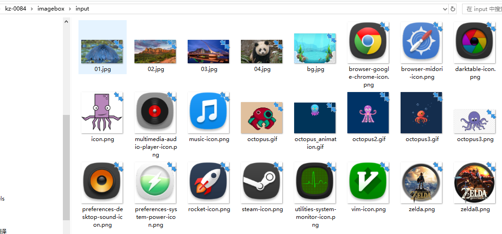

Make sure you have a Python interpreter installed on your computer. If you don't have one, you can download and install Python from the official website at [python.org](https://www.python.org/). During the installation process, ensure that the option to add Python to your system's PATH is selected. This will allow you to run Python from the command line.

If you have just installed the Python interpreter, you will need to install the `Pillow` library using the `pip` command. You can do this by running the following command in your terminal or command prompt:

```bash
pip install pillow
```

For more detailed instructions, please refer to the documentation of the previous project.

Next, create a file named `convert.py` and fill it with the necessary code. Once the file is ready, execute it in your current environment by running:

```bash
python convert.py
```

If the process completes successfully, check the `output` directory to see if the corresponding `*.bin` files have been generated. If the files are successfully created, you can proceed with the subsequent steps.

### Demo Code for Convertor

```Python
import os
from PIL import Image

def convert_to_rgb565(r, g, b):
    return ((r & 0xF8) << 8) | ((g & 0xFC) << 3) | (b >> 3)

def convert_image(source_path, dest_path):
    img = Image.open(source_path).convert("RGB")
    img = img.resize((240, 240))

    with open(dest_path, "wb") as f:
        for y in range(img.height):
            for x in range(img.width):
                r, g, b = img.getpixel((x, y))
                pixel = convert_to_rgb565(r, g, b)
                f.write(pixel.to_bytes(2, 'big'))

def batch_convert(source_dir, dest_dir):
    os.makedirs(dest_dir, exist_ok=True)
    for filename in os.listdir(source_dir):
        if filename.lower().endswith(('.png', '.jpg', '.jpeg')):
            source = os.path.join(source_dir, filename)
            dest = os.path.join(dest_dir, f"{os.path.splitext(filename)[0]}.bin")
            convert_image(source, dest)

# convert the image 
batch_convert("input", "output")

```

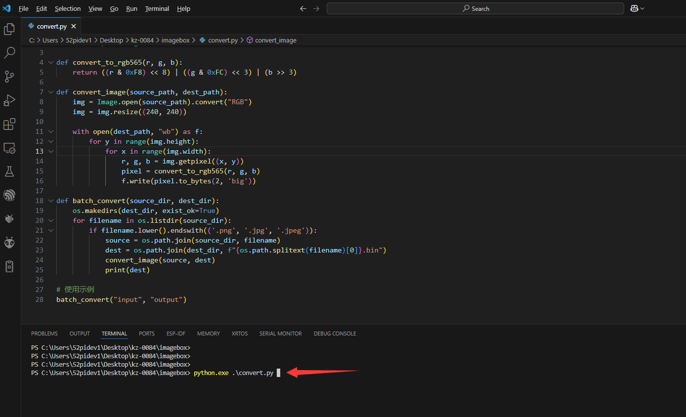

### Convert images 

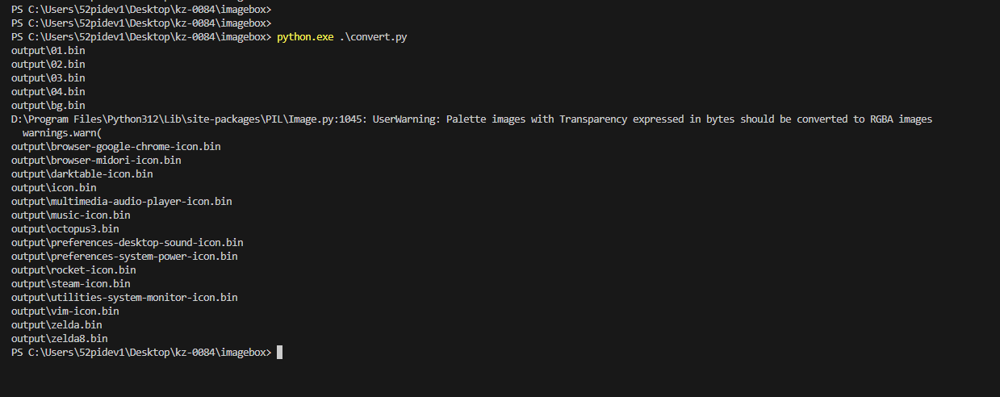

### Check output folder

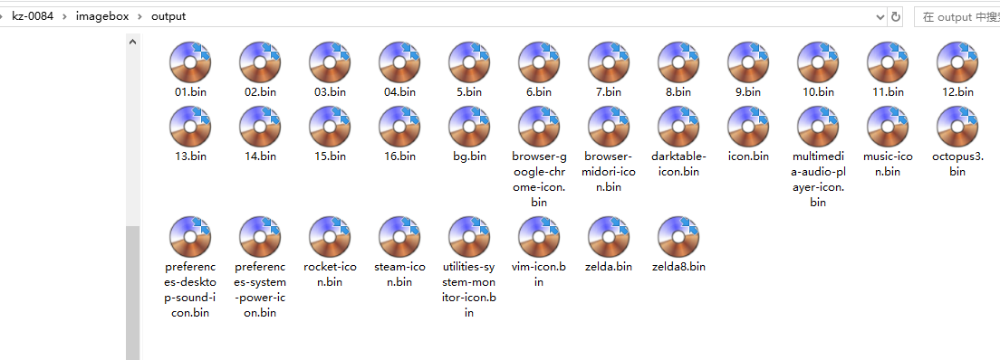

### Upload converted binary file to Pico 2W

* Step.1 Open `Thonny` IDE and click `View`, select `Files`. 

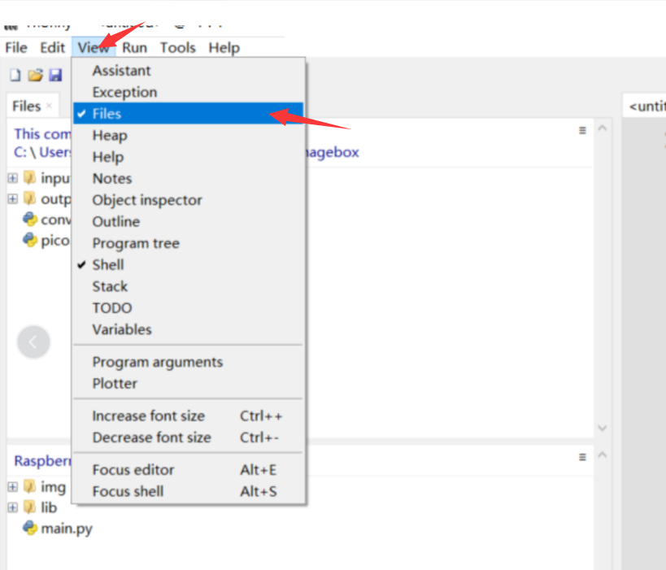

* Step.2 Navigate to binary files location.

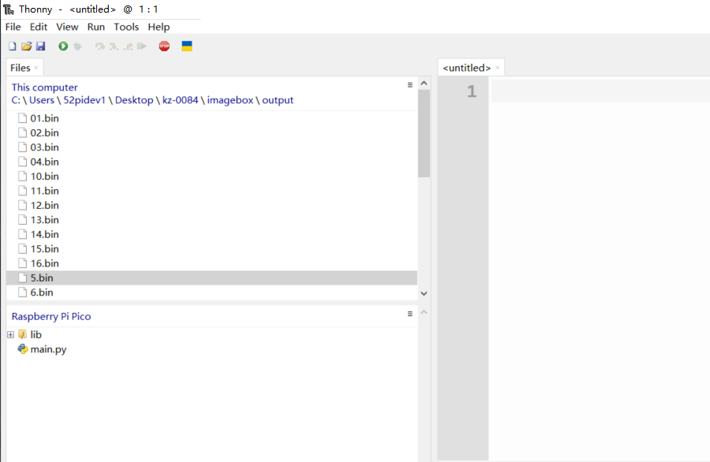

* Create a folder called `imgs` on Pico 2W 

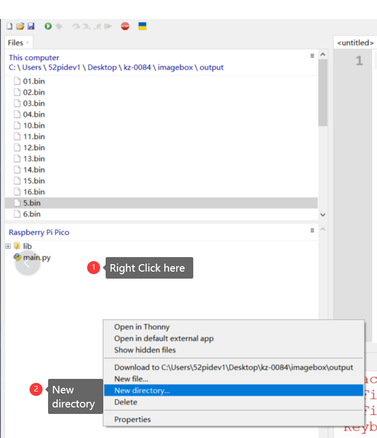
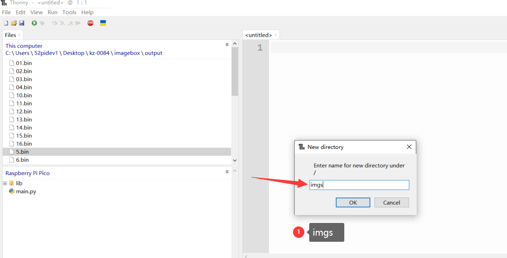

* Enter into `imgs` folder and upload the binary files into it.

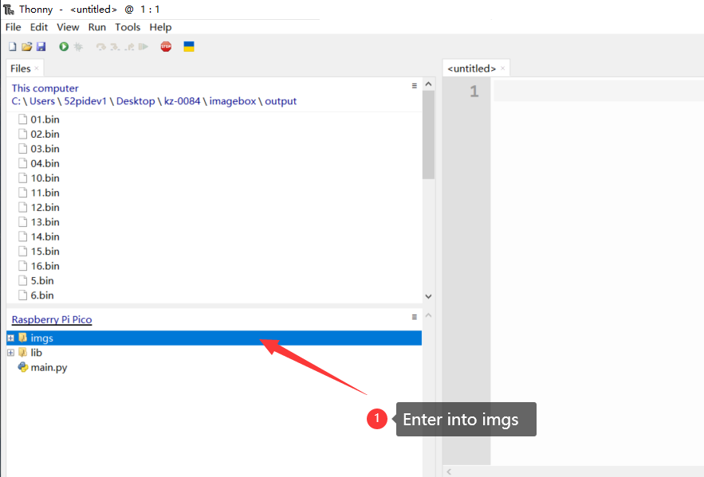

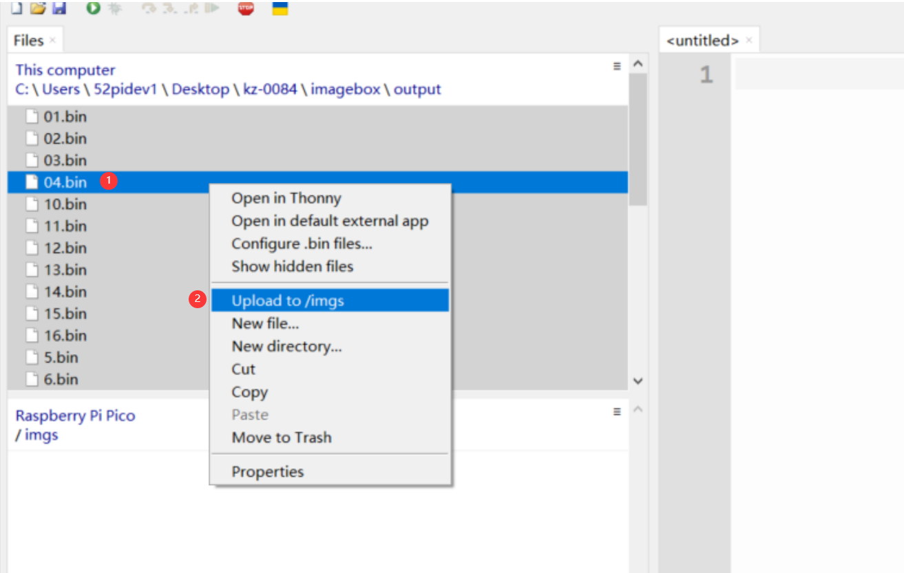
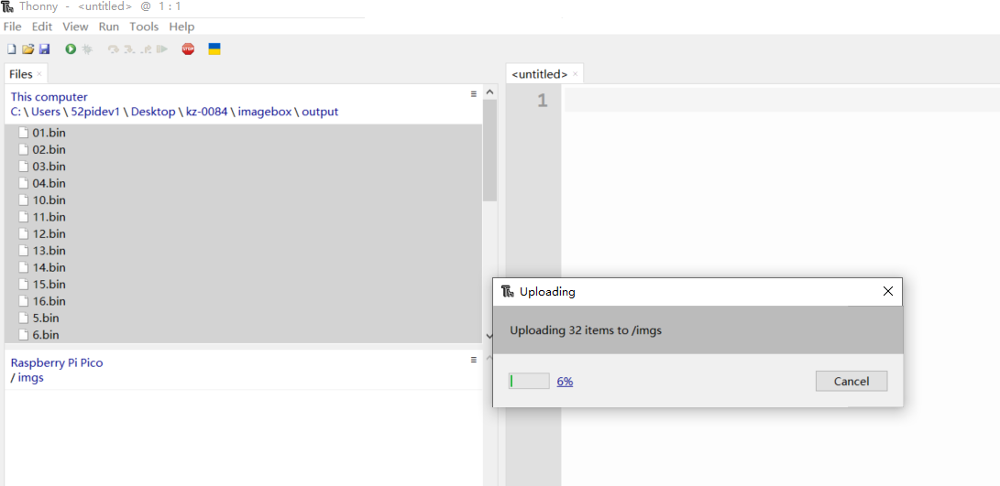

Move to next step, copy and paste following demo code into Raspberry Pi Pico 2W.
and save it to pico 2W, named it `main.py`.

### Demo code 

* On Raspberry Pi Pico 2W 

```Python
import os
import time
from LCD import ST7789

def show_images():
    lcd = ST7789()  # Initialize the ST7789 LCD display driver
    img_dir = "/imgs"  # Define the directory where the image files are stored

    while True:  # Loop indefinitely to continuously display images
        # Get all .bin files in the directory
        files = [f for f in os.listdir(img_dir) if f.endswith(".bin")]
        files.sort()  # Sort the files by name

        for filename in files:  # Iterate through each file in the sorted list
            filepath = f"{img_dir}/{filename}"  # Construct the full file path
            with open(filepath, "rb") as f:  # Open the file in binary read mode
                # Refresh line by line
                for y in range(240):  # Loop through each line (assuming 240 lines)
                    # Read one line of data (240 pixels * 2 bytes per pixel = 480 bytes)
                    line_data = f.read(480)
                    if not line_data:  # If no data is read, break the loop
                        break
                    # Draw the current line (starting at y, with a height of 1 pixel)
                    lcd.fill(0, y, 240, 1, line_data)  # Display the line on the LCD
            time.sleep(1)  # Display each image for 1 second

# Start the image display
show_images()
```

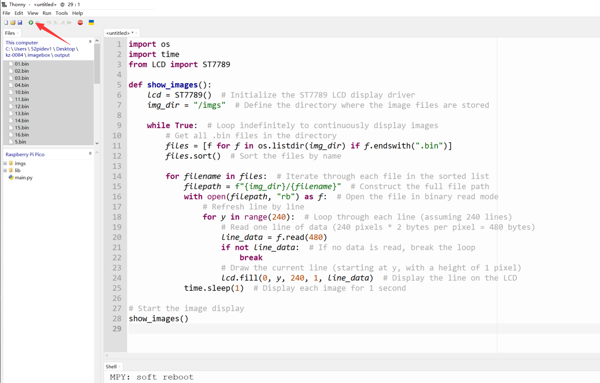

### Image box 

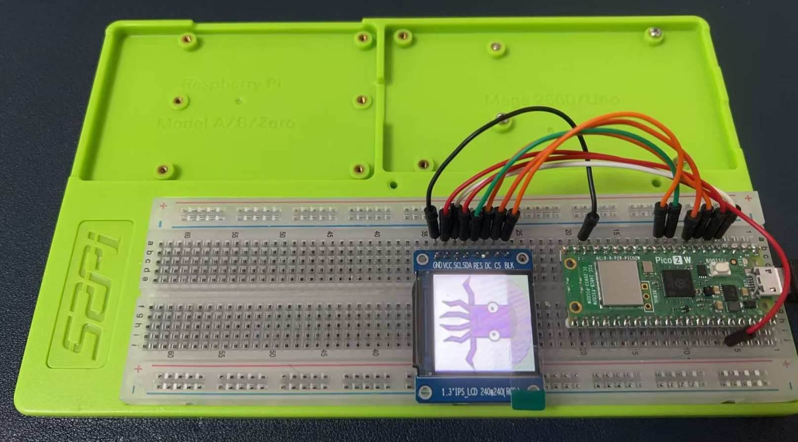

### Code Explanation

The provided Python code is designed to display images stored as binary files on a display screen using the ST7789 LCD driver.

1. **Imports**:
   - `os`: Used to interact with the operating system, specifically to list files in a directory.
   - `time`: Provides the `sleep` function to introduce delays.
   - `ST7789` from `LCD`: This is a driver for the ST7789 LCD display, which handles the low-level operations of displaying images on the screen.

2. **Function Definition**:
   - `def show_images()`: Defines a function to display images.

3. **Initialization**:
   - `lcd = ST7789()`: Initializes the LCD display driver.
   - `img_dir = "/img"`: Specifies the directory where the binary image files are stored.

4. **Infinite Loop**:
   - `while True`: Ensures that the image display process runs continuously.

5. **File Handling**:
   - `files = [f for f in os.listdir(img_dir) if f.endswith(".bin")]`: Lists all files in the specified directory that have a `.bin` extension.
   - `files.sort()`: Sorts the files alphabetically by name.

6. **Image Display**:
   - The code iterates through each file in the sorted list.
   - For each file, it opens the file in binary read mode.
   - It reads the image data line by line (assuming each image is 240 lines high and each pixel is represented by 2 bytes).
   - The `lcd.fill` function is used to display each line of the image on the LCD screen.
   - After displaying an image, the code pauses for 1 second using `time.sleep(1)`.

7. **Continuous Display**:
   - The `while True` loop ensures that the process repeats indefinitely, continuously cycling through the images.

This code is designed for a specific hardware setup involving an ST7789 LCD display and assumes that the images are stored as binary files in the `/img` directory. It reads these files line by line and displays them on the screen, creating a simple image slideshow.

## Development on Language C/C++

The Raspberry Pi Pico-SDK has both advantages and disadvantages in the development process, which are as follows:

### Advantages
- **Comprehensive and Well-Integrated**
  The Pico-SDK is specifically designed for the Raspberry Pi Pico and its RP2040 microcontroller. It provides a comprehensive set of tools and libraries that are tightly integrated with the hardware, making it easier for developers to access and control various features of the Pico, such as GPIO pins, peripherals like SPI, I2C, UART, and DMA. This integration ensures efficient and reliable communication between the software and hardware components.
- **Performance Optimization**
  The SDK is optimized for the Pico's hardware architecture, allowing developers to fully leverage the capabilities of the RP2040's dual-core Cortex-M0+ processor. This can result in better performance and more efficient use of system resources, which is particularly important for applications that require real-time processing or high-speed data handling.
- **Active Community and Support**
  As part of the Raspberry Pi ecosystem, the Pico-SDK benefits from a large and active community of developers. This means that there are plenty of resources available, including tutorials, forums, and example projects, which can help developers quickly get started and troubleshoot any issues they encounter. Additionally, the community-driven nature ensures that the SDK is regularly updated and improved based on user feedback.
- **Cross-Platform Compatibility**
  The Pico-SDK can be used on various operating systems, including Windows, macOS, and Linux. This flexibility allows developers to work in their preferred environment and ensures that the SDK can be easily integrated into different development workflows.

### Disadvantages
- **Learning Curve**
  For beginners or developers who are not familiar with embedded systems or C/C++ programming, the Pico-SDK may have a steep learning curve. Understanding the intricacies of the SDK, as well as the underlying hardware architecture of the Pico, requires a significant amount of time and effort. This can be a barrier to entry for those who are new to this type of development.
- **Complexity in Setup and Configuration**
  Setting up the development environment for the Pico-SDK can be complex. It involves installing multiple tools and dependencies, such as the GNU ARM toolchain, and configuring the build system. Any issues or errors during this process can be difficult to diagnose and resolve, especially for inexperienced developers.
- **Limited Documentation**
  While there are resources available from the community, the official documentation for the Pico-SDK may not always be as comprehensive or detailed as some developers would like. This can make it challenging to fully understand certain aspects of the SDK or to find specific information needed for a particular project. As a result, developers may need to spend additional time searching for answers or experimenting with different approaches.
- **Resource Constraints**
  The Raspberry Pi Pico has limited system resources, such as memory and storage. This can be a limitation when working with the Pico-SDK, as developers need to carefully manage resources to ensure that their applications run efficiently without running out of memory or storage space. This may require optimizing code and using techniques such as memory pooling or data compression to make the most of the available resources.

## Getting Start with Pico-SDK 

In this tutorial, we will use a Raspberry Pi as a Linux host. We will set up the Pico-SDK environment under the Linux environment of the Raspberry Pi and proceed with programming. We will build a simple circuit with each module of the kit one by one and write code to implement applications such as data acquisition and distribution.

Sure, here is a detailed guide on setting up the Pico-SDK environment for the Raspberry Pi Pico 2W on a Raspberry Pi without any VS Code content:

---

### Prerequisites
1. **Hardware**:
   - Raspberry Pi (any model with sufficient resources to run a Linux OS).
   - Raspberry Pi Pico 2W.
   - USB cable for connecting the Pico 2W to the Raspberry Pi.
2. **Software**:
   - Raspberry Pi OS (or any other Linux distribution) installed on the Raspberry Pi.
   - Basic familiarity with Linux commands and terminal operations.

### Step-by-Step Guide

#### Step 1: Update Your Raspberry Pi

Open a terminal on your Raspberry Pi and run the following commands to update your system:

```bash
sudo apt update
sudo apt upgrade -y
```

#### Step 2: Install Required Tools and Libraries

Install the necessary tools and libraries for compiling and flashing code to the Pico 2W:

```bash
sudo apt install git cmake gcc-arm-none-eabi libnewlib-arm-none-eabi build-essential
```

#### Step 3: Clone the Pico-SDK and Pico Examples

Create a directory to store the Pico-related files:

```bash
mkdir ~/pico
cd ~/pico
```

Clone the Pico SDK and examples repositories:

```bash
git clone https://github.com/raspberrypi/pico-sdk.git
cd pico-sdk
git submodule update --init
cd ..
git clone https://github.com/raspberrypi/pico-examples.git
```

#### Step 4: Set Up Environment Variables

Set the `PICO_SDK_PATH` environment variable to point to the SDK directory. This helps the build system locate the SDK. Add the following line to your `~/.bashrc` file to make it permanent:

```bash
echo 'export PICO_SDK_PATH=~/pico/pico-sdk' >> ~/.bashrc
source ~/.bashrc
```

#### Step 5: Build the Pico Examples

Navigate to the examples directory and create a build directory:

```bash
cd ~/pico/pico-examples
mkdir build
cd build
```

Configure the build system using CMake, specifying the Pico 2W board:

```bash
cmake -DPICO_BOARD=pico_w ..
```

Build the examples:

```bash
make
```

#### Step 6: Flash an Example to the Pico 2W

To flash an example project (e.g., the blink example) to the Pico 2W, follow these steps:

1. **Prepare the Pico 2W for Flashing**:
   - Hold the **BOOTSEL** button on the Pico 2W while connecting it to the Raspberry Pi via USB. The Pico 2W should appear as a USB mass storage device named `RPI-RP2`.
   - Release the **BOOTSEL** button once the Pico 2W is recognized.

2. **Copy the UF2 File to the Pico 2W**:
   - Navigate to the example project directory and build it:
     ```bash
     cd ~/pico/pico-examples/build/pico_w/blink
     make
     ```
   - Copy the generated `.uf2` file to the Pico 2W storage device:
     ```bash
     cp blink.uf2 /media/pi/RPI-RP2/
     ```
   - The Pico 2W will automatically reboot and run the example.

#### Step 7: Create and Build Your Own Project

To create your own project, follow these steps:

1. **Create a New Project Directory**:

   ```bash
   mkdir ~/pico/my_project
   cd ~/pico/my_project
   ```

2. **Initialize the Project**:
   - Create a `CMakeLists.txt` file to configure the build system. Here’s a basic example:
     ```cmake
     cmake_minimum_required(VERSION 3.13.1)
     include($ENV{PICO_SDK_PATH}/external/pico_sdk_import.cmake)
     project(my_project)

     pico_sdk_init()

     add_executable(my_project main.c)
     pico_add_extra_outputs(my_project)
     ```

   - Create a `main.c` file with your code. For example:
     ```c
     #include "pico/stdlib.h"

     int main() {
         stdio_init_all();
         while (true) {
             printf("Hello, Pico 2W!\n");
             sleep_ms(1000);
         }
     }
     ```

3. **Build the Project**:
   - Create a build directory and configure the project:
     ```bash
     mkdir build
     cd build
     cmake -DPICO_BOARD=pico_w ..
     make
     ```

4. **Flash the Project to the Pico 2W**:
   - Follow the same steps as in Step 6 to flash the `.uf2` file to the Pico 2W.

### Experiment in C/C++ 

* [Project 1](./project1.md)
* [Project 2](./project2.md)
* [Project 3](./project3.md)
* [Project 4](./project4.md)
* [Project 5](./project5.md)
* [Project 6](./project6.md)
* [Project 7](./project7.md)
* [Project 8](./project8.md)
* [Project 9](./project9.md)
* [Project 10](./project10.md)
* [Project 11](./project11.md)
* [Project 12](./project12.md)

### Conclusion
By following these steps, you should have a fully functional Pico-SDK environment on your Raspberry Pi, ready for developing applications for the Raspberry Pi Pico 2W. You can now proceed to write your own code, build projects, and flash them to the Pico 2W using the terminal and command-line tools.


[11]: http://docs.52pi.com/md/kz-0084/projects/#experiment-1-blinking-a-led
[12]: http://docs.52pi.com/md/kz-0084/projects/#experiment-2-reading-a-flame-sensor 
[13]: http://docs.52pi.com/md/kz-0084/projects/#experiment-3-measuring-soil-moisture
[14]: http://docs.52pi.com/md/kz-0084/projects/#experiment-4-controlling-a-servo-motor
[15]: http://docs.52pi.com/md/kz-0084/projects/#experiment-5-measuring-distance-with-an-ultrasonic-sensor
[16]: http://docs.52pi.com/md/kz-0084/projects/#experiment-6-detecting-light-intensity-with-a-light-sensor
[17]: http://docs.52pi.com/md/kz-0084/projects/#experiment-7-Control-the-durationrof-led-by-using-HW-233-slid-pot
[18]: http://docs.52pi.com/md/kz-0084/projects/#experiment-8-detecting-sound-with-a-sound-sensor
[19]: http://docs.52pi.com/md/kz-0084/projects/#experiment-9-controlling-a-buzzer
[20]: http://docs.52pi.com/md/kz-0084/projects/#experiment-10-using-a-rotary-encoder
[21]: http://docs.52pi.com/md/kz-0084/projects/#experiment-11-1.3inch-IPS_LCD-display 
[22]: http://docs.52pi.com/md/kz-0084/projects/#experiment-12-1.3inch-IPS_LCD-Imagebox

### Conclusion

These experiments provide a foundation for using the Raspberry Pi Pico 2 WH with various sensors and components. Feel free to modify the code and circuit to suit your needs and explore more advanced applications!
Happy experimenting!

### Support

If you encounter any issues or have questions while using the kit, please refer to the instruction manual or contact our support team for assistance. We are here to help you on your journey into the exciting world of electronics and programming!

Happy experimenting with your Raspberry Pi Pico 2 WH Starter Kit!
